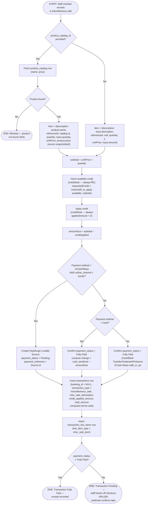

# M08 · Miscellaneous Sale Entry

**Actors:** Cashier, Receptionist, Supervisor, Admin, Superadmin (create);
Admin, Superadmin only (update/delete)
**Code:** `server/src/features/billing/services/miscSale.service.ts`,
`server/src/features/billing/services/creditStub.service.ts`,
`server/src/features/billing/services/paymentMethod.service.ts`,
`server/src/features/billing/services/paymongo.service.ts`,
`server/src/features/billing/modules/validators/billing.validator.ts`,
`server/src/features/billing/billing.routes.ts`
**Part of:** [[M08-sales-billing|M08 · Sales & Billing]]

A misc sale records a transaction with no underlying booking
(`booking_id = NULL`, `transaction_type = 'miscellaneous_sale'`) — a
catalog product or a freetext item, sold by a money-handling staff member,
reusing the same credit-application and payment-confirmation logic as a
cashier's [[M08-01-cashier-checkout|counter checkout]] rather than
duplicating it.

## Notes

- Exactly one item shape is allowed per sale — `product_catalog_id` (+
  optional `quantity`) or `description` + `amount` — enforced by the
  request validator before this diagram's logic runs; the diagram shows
  only the resulting catalog-lookup vs. freetext branches. The freetext
  branch trusts `input.amount` as-is since there's no catalog row to
  server-snapshot a price from.
- Credit application is the same always-₱0 stub `checkoutAggregation.service.ts`
  uses ([[M08-01-cashier-checkout|Cashier Checkout]]) — `credit_applied_amount`
  is written to the transaction but never actually reduces `total_amount`
  yet (see [[M10-credit-balance-management|M10]]).
- `customer_id` is required (`transactions.customer_id` is `NOT NULL`) even
  though there's no booking to derive it from — every misc sale is tied to
  an existing customer profile, which credit redemption also needs.
- Unlike cashier checkout, no `payment_confirmed` notification fires here,
  whether the sale resolves Fully Paid immediately or later via the
  PayMongo webhook — the webhook confirms a misc sale's `Pending` row the
  same way it confirms any other (see
  [[M08-02-customer-self-service-online-payment|the webhook flow]]), but
  only advances `payment_stage` when a `booking_id` is present, which a
  misc sale never has.
- `processed_by_staff_id` is only set when the sale resolves Fully Paid
  immediately, left unattributed for a Pending PayMongo-portal sale — same
  rule as cashier checkout.
- Update (Admin/Superadmin only) recomputes `line_total`/`total_amount`
  server-side whenever the item shape changes, never trusting a
  client-supplied total; it does not re-run credit or payment-method logic.
  Delete is a hard delete of the transaction row, also Admin/Superadmin
  only. Neither is diagrammed here — both are straightforward field-level
  CRUD with no further branching.

## Relationship to other modules

Shares credit-application (stub) with [[M10-credit-balance-management|M10]]
and the payment-confirmation/webhook mechanism with
[[M08-02-customer-self-service-online-payment|M08's online payment flow]].
Feeds [[M14-report-management|M14]] under its own DSR category.
