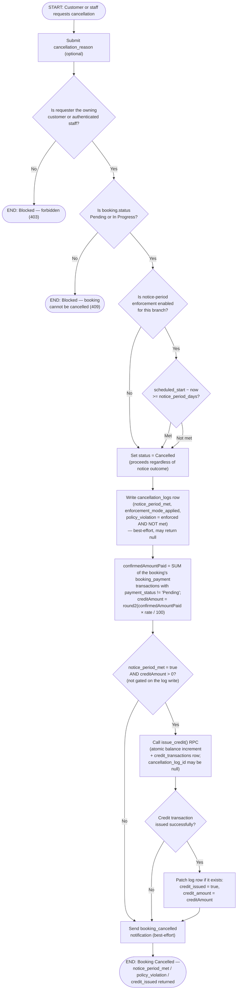

# M09 · Cancellation Notice-Period Check & Credit Conversion

**Actors:** Customer, Staff (any authenticated staff role, or the owning customer)
**Code:** `server/src/features/booking/services/cancellation.service.ts`,
`server/src/features/booking/services/cancellationLog.service.ts`,
`server/src/features/booking/services/reschedule.service.ts` (shared `evaluateNoticePeriod`),
`server/src/features/credits/services/creditIssuance.service.ts`
**Part of:** [[M09-policy-enforcement|M09 · Policy Enforcement]]

When a customer or staff member cancels a booking, the system checks how far
ahead of the scheduled appointment the cancellation happens, always logs the
event, and converts a configurable share of what the customer already paid
into a credit — but only if the configured notice period was met. A
cancellation is never blocked by the notice check — only the financial
consequence changes.

## Notes

- **A cancellation is never blocked**, regardless of `Strict` vs `Soft`
  enforcement mode — the mode only decides `policy_violation` on the logged
  row and the credit outcome, unlike a Strict reschedule, which _is_ blocked
  outright (see [[M09-02-reschedule-notice-fee-decision|M09-02]]).
- **Credit issuance is no longer gated on the log write** (issue #117). A
  failed `writeCancellationLog` used to skip the credit check entirely;
  now `issueCredit` is called with a `null` `cancellation_log_id`
  (`credit_transactions.cancellation_log_id` is nullable) and only the
  log-row summary is lost.
- **The amount converted is what was _confirmed-paid_, times a rate.**
  `confirmedAmountPaid` is `SUM(total_amount)` of the booking's
  `booking_payment` `transactions` whose `payment_status` is not `'Pending'`
  (a settled downpayment is `'Partially Paid'`, a settled full/remaining
  payment is `'Fully Paid'`) — **not** `bookings.payment_stage`, which an
  Online booking with no down-payment requirement can reach (`'Paid'`)
  before any money is collected. `creditAmount = round2(confirmedAmountPaid ×
cancellation_credit_conversion_rate / 100)`, where the rate is a
  branch-scoped `policy_configurations` column (`0`–`100`, default `100`),
  editable on Settings → Config → Policies. So a fully-paid booking of any
  category can qualify (not just Hotel / down-payment bookings), and a
  booking with no confirmed transaction — an unpaid down-payment
  reservation, or one wrongly at `payment_stage = 'Paid'` — gets nothing.
- `notice_enforcement_enabled = false` short-circuits the whole check to
  "met" (`evaluateNoticePeriod` returns `{ enforced: false, met: true }`),
  so a disabled policy always qualifies for credit if the customer has a
  confirmed payment and the rate is above 0.
- `issueCredit()` wraps a single atomic Postgres function (`issue_credit`,
  migration `...097`) rather than a separate balance-read + insert, so the
  `credit_balances` increment and the `credit_transactions` issuance row
  can't diverge.
- The `sendBookingCancelledNotification` email/in-app dispatch is
  best-effort and runs last, after the credit decision is fully resolved,
  so its message can state the credited amount (or omit it) correctly.

## Relationship to other modules

Credit issuance posts to [[M10-credit-balance-management|M10]]'s
`credit_balances`/`credit_transactions`. The notice-period policy itself is
configured via `GET`/`PATCH /bookings/policy`, read here through
`resolveEffectivePolicy()` (shared with
[[M09-02-reschedule-notice-fee-decision|M09-02]] and
[[M03-appointment-booking|M03]]). Notification dispatch goes through
[[M11-notification|M11]].
