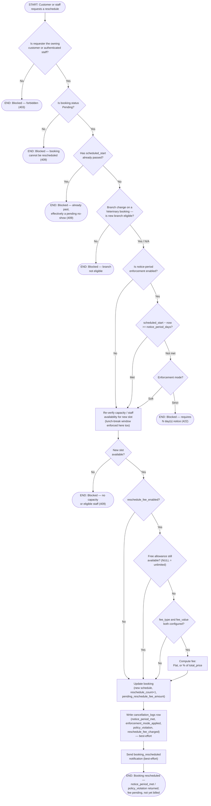

# M09 · Reschedule Notice-Period Enforcement & Fee Calculation

**Actors:** Customer, Staff (any authenticated staff role, or the owning customer)
**Code:** `server/src/features/booking/services/reschedule.service.ts`,
`server/src/features/booking/services/rescheduleFee.service.ts`,
`server/src/features/booking/services/cancellationLog.service.ts`
**Part of:** [[M09-policy-enforcement|M09 · Policy Enforcement]]

When a booking is rescheduled, the system checks how far ahead of the
_current_ appointment time the change is being made. Unlike a cancellation,
an unmet notice period under Strict enforcement blocks the reschedule
outright; under Soft it's allowed but flagged. Once the notice check clears
and the new slot is confirmed available, a reschedule fee is calculated
against the configured free-reschedule allowance and stored on the booking
for later billing.

## Notes

- **Strict enforcement blocks a reschedule outright** (422) — the opposite
  of cancellation, where Strict only withholds credit and never blocks (see
  [[M09-01-cancellation-notice-credit-decision|M09-01]]). Soft mode allows
  the reschedule either way and only sets `policy_violation = true` on the
  logged row.
- Notice is measured against the booking's **current** `scheduled_start`,
  not the new one being requested — "how far ahead of the existing
  appointment is this change happening."
- **The lunch-break rule doesn't get its own workflow** in this module: for
  Grooming/Veterinary reschedules, the same `get_staff_availability()`
  Postgres function used for the capacity re-check also enforces the
  branch's `lunch_break_enabled`/`lunch_break_start`/`lunch_break_end`
  window as a hard filter — a reschedule into that window returns zero
  eligible staff, indistinguishable in the API response from a genuine
  capacity conflict. It's one guard clause inside a query already owned by
  [[M03-appointment-booking|M03]]'s Slot/Staff Picker, not a standalone
  business process with its own actors or outcome, so it's documented here
  as a note rather than a third diagram.
- `reschedule_free_allowance = NULL` means unlimited free reschedules
  (documented default) — a fee never applies regardless of
  `reschedule_count`, even with `reschedule_fee_enabled = true`.
- The fee is calculated against the **pre-reschedule** `reschedule_count`
  and `total_price` — a pure function (`calculateRescheduleFee`) with no DB
  access of its own, folded into the same `bookings` update the rest of the
  reschedule already makes.
- A fee is stored on `pending_reschedule_fee_amount` and on the
  `cancellation_logs.reschedule_fee_charged` snapshot, but is **not yet**
  posted as a billable line item at checkout — that gap is called out
  explicitly in the module note and belongs to [[M08-sales-billing|M08]].
- Every completed reschedule writes a `cancellation_logs` row, same as
  cancellation — a Strict-blocked attempt never reaches that write, since it
  never actually happened.

## Relationship to other modules

The notice-period policy and reschedule-fee configuration are both read
through `resolveEffectivePolicy()`, shared with
[[M09-01-cancellation-notice-credit-decision|M09-01]]. Capacity/staff
availability re-checking (including the lunch-break filter) belongs to
[[M03-appointment-booking|M03]]. The stored fee amount is not yet posted to
[[M08-sales-billing|M08]]. Notification dispatch goes through
[[M11-notification|M11]].
