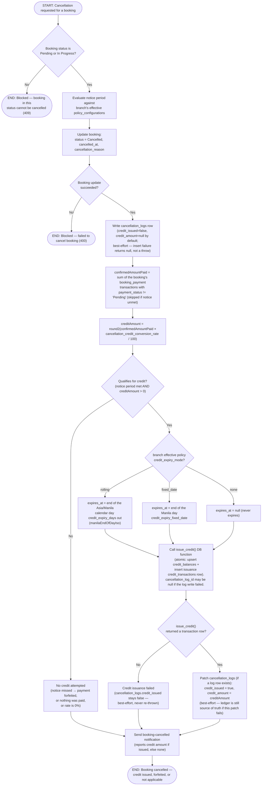

# M10 · Cancellation-to-Credit Conversion

**Actors:** Customer, any staff member (whoever is cancelling), Admin/Superadmin (policy configuration)
**Code:** `server/src/features/booking/services/cancellation.service.ts`,
`server/src/features/booking/services/cancellationLog.service.ts`,
`server/src/features/credits/services/creditIssuance.service.ts`,
`server/src/features/credits/modules/creditExpiry.util.ts`,
`supabase/migrations/20260902159_m10_policy_credit_expiry_mode.sql`,
`supabase/migrations/20260902160_m10_credit_expiry_manila_end_of_day.sql`
**Part of:** [[M10-credit-balance-management|M10 · Credit Balance Management]]

A customer or staff member cancels a booking. Cancellation itself is never
blocked by an unmet notice period — what the notice outcome decides is
whether the money the customer already paid is converted into branch-locked
credit or simply forfeited. "Money paid" means the booking's **confirmed**
`booking_payment` transactions (a cashier or the PayMongo webhook has moved
them off `Pending`), not `bookings.payment_stage` — an Online booking with
no down-payment requirement can read `payment_stage = 'Paid'` before a peso
is collected, and cancelling that must not mint credit. When credit is
issued, only a configurable percentage of the paid amount becomes credit
(`cancellation_credit_conversion_rate`, default 100% — the advisor asked for
this to be adjustable, e.g. down to 50%, so a late-ish cancellation can keep
part of the payment as a charge).

## Notes

- Cancellation and credit issuance are **not** one atomic unit: the booking
  status update, the `cancellation_logs` insert, and the `issue_credit()`
  call are three separate steps. Only the balance-increment + issuance-row
  pair inside `issue_credit()` itself is atomic (a single PL/pgSQL function,
  `SECURITY DEFINER`, called via RPC) — see
  `supabase/migrations/20260805097_m10_create_credit_transactions_schema.sql`.
- **What gets converted is the amount _confirmed-paid_, not the configured
  downpayment and not `payment_stage`.** `confirmedAmountPaid` is the sum of
  the booking's `booking_payment` `transactions` rows whose `payment_status`
  is not `'Pending'` — a cashier or the PayMongo webhook has actually
  settled them (`'Partially Paid'` for a down payment, `'Fully Paid'` for a
  full/remaining payment). A booking paid in full returns its whole settled
  amount; a downpayment-only booking returns the downpayment; a booking with
  no confirmed transaction — including an Online booking wrongly sitting at
  `payment_stage = 'Paid'` with nothing collected, or a still-Pending
  down-payment reservation — returns nothing.
- **The conversion rate** is `policy_configurations.cancellation_credit_conversion_rate`
  — a percentage `0`–`100`, `NOT NULL DEFAULT 100`, branch-scoped and
  resolved by the same `resolveEffectivePolicy()` used for the notice
  period, reschedule fee, and credit expiry. Editable on Settings → Config →
  Policies (Admin/Superadmin). `creditAmount = round2(amountPaid × rate /
100)`; a rate of `0` means a qualifying cancellation converts nothing.
  Migration `supabase/migrations/20260901149_m10_policy_cancellation_credit_conversion_rate.sql`.
- A Strict-mode unmet notice period never blocks cancellation the way it
  blocks a _reschedule_ — it only withholds credit. This mirrors the
  distinction already documented for reschedule's own notice check.
- Any booking with a confirmed payment can now qualify — including a
  fully-paid Grooming/Daycare/Veterinary booking, which previously could
  never get credit because the old logic keyed off `downpayment_amount`
  alone. The notice period still has to be met.
- **A failed `cancellation_logs` insert no longer skips credit issuance**
  (previously the guard was `qualifies && log`; issue #117).
  `credit_transactions.cancellation_log_id` is nullable, so the credit is
  issued with a null link and only the log-row summary is lost. A failed
  `issue_credit()` RPC still just leaves `credit_issued = false`; a failed
  patch of the log row after a successful issuance leaves the ledger correct
  but the log's summary fields stale. None of these raise an error back to
  the caller — the booking is already cancelled by the time any of them can
  happen.
- **Expiry at issuance is now a three-way `credit_expiry_mode` enum**, not the
  old `credit_expiry_enabled` boolean (dropped in migration
  `20260902159_m10_policy_credit_expiry_mode.sql`). It resolves through the
  same `resolveEffectivePolicy()` (`notice.policy`) as the conversion rate and
  notice period:
  - `none` → `expires_at = null` (credit never expires — the old
    `enabled = false`).
  - `rolling` → `expires_at = manilaEndOfDayIso(now + credit_expiry_days)` —
    the `23:59:59.999` instant of the Asia/Manila calendar day that many days
    out (`credit_expiry_days` default `30`). This is the old `enabled = true`
    behaviour, just formally named and snapped to end-of-day.
  - `fixed_date` → `expires_at = manilaEndOfDayIso(credit_expiry_fixed_date)` —
    end of that one Manila calendar day, shared by every lot the branch issues.
- **Why Manila end-of-day** (`creditExpiry.util.ts`, migration `20260902160`):
  credit expires per calendar day in the one timezone every branch uses
  (Asia/Manila, UTC+8, no DST). Stamping an exact time-of-day made two lots
  issued hours apart on the same day render as separate expiry rows with
  different "days left", and a UTC end-of-day for "Dec 31" read as "Jan 1" in
  Manila. `reapply_branch_credit_expiry()` stamps the identical instant, so a
  fresh lot and retroactively re-stamped ones line up exactly.
- A `credit_expiry_days` change or a `credit_expiry_mode`/`credit_expiry_fixed_date`
  change on the branch's policy is **retroactive** — see
  [[M10-05-credit-expiry-policy-retroactive-restamp|M10-05]] — but that is a
  separate flow triggered by the admin's `PATCH /bookings/policy`, not by this
  cancellation.
- The `fixed_date`-without-a-date state is unreachable through the API: a
  `policy_configurations` CHECK constraint plus the `updatePolicyValidator`
  `superRefine` both reject it, so the `&& expiryFixedDate` guard in
  `cancellation.service.ts` is defence-in-depth (it would fall through to
  `expires_at = null`).

## Relationship to other modules

Triggered from [[M09-policy-enforcement|M09]]'s cancellation flow
(`evaluateNoticePeriod()`), which reads the same `policy_configurations`
table this workflow reads for the conversion-rate / credit-expiry rules. The
amount it converts is the sum of the booking's **confirmed** `booking_payment`
`transactions` (settled by a cashier or the PayMongo webhook), driven by
[[M08-billing-payments|M08]]'s payment flow — not `bookings.payment_stage`.
Feeds [[M14-report-management|M14]]'s DSR credit-usage section (issuance here;
redemption and expiry are live too since the 2026-09-01 payment rework). The
navbar credit indicator and `/portal/credits`
([[M10-03-credit-balance-and-history-access|M10-03]]) read the resulting
`credit_balances` and refresh right after this flow issues credit; the
issued lot's `expires_at` can later be bulk-re-stamped by
[[M10-05-credit-expiry-policy-retroactive-restamp|M10-05]].
