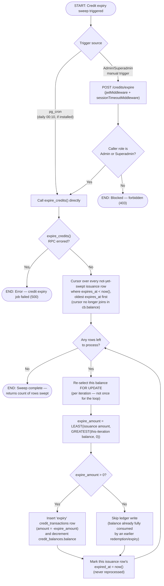

# M10 · Credit Expiry Sweep

**Actors:** system (pg_cron, when installed), Admin, Superadmin (manual trigger)
**Code:** `server/src/features/credits/services/creditExpiry.job.ts`,
`server/src/features/credits/credits.controller.ts`,
`supabase/migrations/20260805098_m10_create_credit_expiry_function.sql` (original),
`supabase/migrations/20260902159_m10_policy_credit_expiry_mode.sql` (re-creates `expire_credits()` with a per-iteration balance re-read),
`supabase/migrations/20260902160_m10_credit_expiry_manila_end_of_day.sql` (snaps outstanding lots to Manila end-of-day)
**Part of:** [[M10-credit-balance-management|M10 · Credit Balance Management]]

Every issued credit that has an `expires_at` gets swept once it passes: a
`expire_credits()` database function writes an offsetting negative
`credit_transactions` row and decrements the balance. It runs on a daily
`pg_cron` schedule where the extension is installed; otherwise an Admin/
Superadmin-triggered endpoint is the **primary** mechanism, not just a
verification aid.

## Notes

- Rows are processed **oldest `expires_at` first**, which matters when a
  balance has been partly drawn down by redemption before its oldest issuance
  expires — `expire_amount` is capped at whatever the balance can still cover
  (`LEAST(issuance amount, GREATEST(balance, 0))`), not the full original
  issuance amount. Redemption **is live** since the 2026-09-01 payment rework
  (`redeem_credit()` via `creditStub.service.ts`/`applyCredit` in
  [[M08-sales-billing|M08]]), so this cap is now a real, exercised path — a
  redemption effectively "comes out of" the customer's latest-expiring credit
  because `redeem_credit()` only decrements the balance number, it doesn't
  attribute to a lot.
- **The balance is re-read `FOR UPDATE` on every loop iteration** (migration
  `20260902159` re-created `expire_credits()` for this). The `20260805098`
  version pulled `cb.balance` once through the cursor's join, so if a customer
  had several not-yet-swept lots sharing one `expires_at` — the normal case
  under `fixed_date` mode, or after a retroactive re-stamp — each lot capped
  against the _stale original_ balance. When their nominal total exceeded the
  balance, that drove `credit_balances.balance` below `0`, tripping the
  `balance >= 0` CHECK and **aborting the entire sweep**. Re-selecting per
  iteration makes each lot expire only `min(its amount, what is actually
left)`.
- **Same-day lots now share one `expires_at`.** Migration `20260902160` snapped
  every outstanding issuance lot's `expires_at` to the end of its Asia/Manila
  calendar day, and issuance ([[M10-01-cancellation-to-credit-conversion|M10-01]])
  plus the retroactive re-stamp
  ([[M10-05-credit-expiry-policy-retroactive-restamp|M10-05]]) do the same for
  new/changed lots. `expire_credits()` itself was **not** changed by
  `20260902160` — it still just compares `expires_at < now()`; the snap only
  means the multi-lot-same-date case above is common rather than rare.
- An issuance row's `expired_at` is set **even when `expire_amount` is 0**
  (balance already zero) — it is never reprocessed either way. `expired_at`
  is only ever set on `issuance` rows (enforced by a `CHECK` constraint), as
  the marker for "has this issuance already been swept".
- `expire_credits()` is `SECURITY DEFINER`, granted to both `authenticated`
  and `service_role` — the manual-trigger endpoint calls it through the
  server's service-role client, but the grant to `authenticated` exists for
  any future direct-RPC path.
- The `pg_cron` schedule itself is created conditionally, only if the
  extension is already installed (a `DO` block at migration time) — its
  absence is a known Open Item, which is exactly why the manual endpoint is
  documented as primary, not a fallback.

## Relationship to other modules

Feeds [[M14-report-management|M14]]'s DSR credit-usage figures. Issuance,
redemption (live since the 2026-09-01 payment rework), and expiry activity all
populate `credit_transactions`. The `expires_at` values this sweep reads are
set at issuance ([[M10-01-cancellation-to-credit-conversion|M10-01]]) and can
be re-stamped in bulk when an admin changes a branch's credit-expiry policy
([[M10-05-credit-expiry-policy-retroactive-restamp|M10-05]]).
