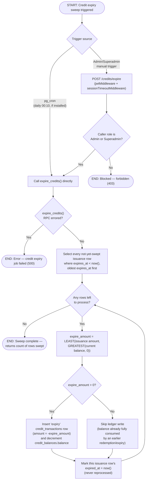

# M10 · Credit Expiry Sweep

**Actors:** system (pg_cron, when installed), Admin, Superadmin (manual trigger)
**Code:** `server/src/features/credits/services/creditExpiry.job.ts`,
`server/src/features/credits/credits.controller.ts`,
`supabase/migrations/20260805098_m10_create_credit_expiry_function.sql`
**Part of:** [[M10-credit-balance-management|M10 · Credit Balance Management]]

Every issued credit that has an `expires_at` gets swept once it passes: a
`expire_credits()` database function writes an offsetting negative
`credit_transactions` row and decrements the balance. It runs on a daily
`pg_cron` schedule where the extension is installed; otherwise an Admin/
Superadmin-triggered endpoint is the **primary** mechanism, not just a
verification aid.

## Notes

- Rows are processed **oldest `expires_at` first**, which matters when a
  balance has been partly drawn down (by redemption, once that path ships)
  before its oldest issuance expires — `expire_amount` is capped at
  whatever the balance can still cover
  (`LEAST(issuance amount, GREATEST(balance, 0))`), not the full original
  issuance amount.
- Because credit redemption at checkout is stubbed to always apply `0`
  ([[M10-credit-balance-management|M10]]'s Status section — `creditStub.service.ts`
  in [[M08-sales-billing|M08]] has not been swapped for the real
  `credit_balances`-backed implementation), in practice today `expire_amount`
  always equals the full issuance amount — the cap only becomes meaningful
  once redemption is wired up.
- An issuance row's `expired_at` is set **even when `expire_amount` is 0**
  (balance already zero) — it is never reprocessed either way. `expired_at`
  is only ever set on `issuance` rows (enforced by a `CHECK` constraint), as
  the marker for "has this issuance already been swept".
- `expire_credits()` is `SECURITY DEFINER`, granted to both `authenticated`
  and `service_role` — the manual-trigger endpoint calls it through the
  server's service-role client, but the grant to `authenticated` exists for
  any future direct-RPC path.
- The `pg_cron` schedule itself is created conditionally, only if the
  extension is already installed (a `DO` block at migration time) — its
  absence is a known Open Item, which is exactly why the manual endpoint is
  documented as primary, not a fallback.

## Relationship to other modules

Feeds [[M14-report-management|M14]]'s DSR credit-usage figures once
redemption exists — currently only issuance and expiry activity populate
`credit_transactions`.
