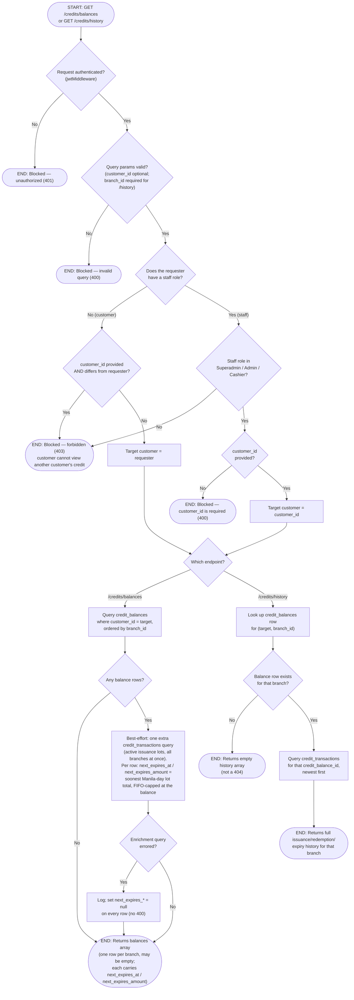

# M10 · Credit Balance & History Access

**Actors:** Customer (self-service), Cashier, Admin, Superadmin
**Code:** `server/src/features/credits/services/creditBalance.service.ts`,
`server/src/features/credits/credits.controller.ts`,
`server/src/features/credits/modules/validators/credits.validator.ts`,
`server/src/features/credits/modules/creditExpiry.util.ts`
**Part of:** [[M10-credit-balance-management|M10 · Credit Balance Management]]

`GET /credits/balances` and `GET /credits/history` are a single
role-branching endpoint pair, open to both customers and staff behind plain
`jwtMiddleware` — who is actually allowed to see whose balance is resolved
inside the service layer, not by separate route surfaces.

## Notes

- **`GET /credits/balances` enriches each row with `next_expires_at` +
  `next_expires_amount`.** After the balance rows come back, the service runs
  **one** extra query against `credit_transactions` (all the returned balance
  ids at once — `transaction_type = 'issuance'`, `expired_at IS NULL`,
  `expires_at IS NOT NULL`, sorted ascending). For each balance,
  `nextExpiry()` takes the lots falling on the **soonest Asia/Manila calendar
  day** (`manilaDayKey`), sums their nominal amounts, and caps that at the
  current balance — the same FIFO / "only down to the balance" rule
  `expire_credits()` applies ([[M10-02-credit-expiry-sweep|M10-02]]).
  `next_expires_at` is the `manilaEndOfDayIso` of that day; both fields are
  `null` when the balance has no expiring lot or is `<= 0`. This exists so the
  navbar wallet pill and its hover popover can show "₱X expires `<date>`"
  without a per-branch `/credits/history` round-trip.
- **The enrichment is best-effort.** If that second query errors, the service
  logs it (`console.error`) and returns the **bare** balance rows with
  `next_expires_* = null` — it does **not** 400 the whole list. `/portal/credits`
  and the pill still render, just without the expiry hint.
- `/credits/history` is unchanged — no enrichment, still one branch at a time.
- A customer with no staff role can only ever resolve to themself — passing
  someone else's `customer_id` as a customer is a 403, not silently ignored.
- A staff caller who lacks a recognized credit role (`Superadmin`, `Admin`,
  `Cashier`) is forbidden even though they're authenticated staff —
  deliberately narrower than the wider Supervisor/Receptionist set
  [[M08-sales-billing|M08]]'s own billing read roles include, per the
  code's own comment referencing AC-3.
- `/credits/history` always scopes to exactly one branch (`branch_id` is
  required, unlike `/credits/balances` which returns every branch a
  customer has a row for) — this matches the branch-lock:
  `credit_balances` is `UNIQUE(customer_id, branch_id)`.
- A customer/branch pair with no `credit_balances` row yet returns an empty
  array from `/credits/history`, not a 404 — "never had credit at this
  branch" and "had credit and it's all been consumed" look the same at the
  balances level, but history additionally distinguishes them by simply
  being empty either way at the row-lookup step.
- RLS policies on both tables (customer reads own row via `auth.uid()`;
  Cashier/Admin/Superadmin read any) exist as a second line of defense
  behind this application-layer authorization — both were read from
  `supabase/migrations/20260805096_m10_create_credit_balances_schema.sql`
  and `...097_m10_create_credit_transactions_schema.sql`.

## Relationship to other modules

Backs the customer portal's own balance view
([[M02-customer-portal-pet-management|M02]]) and the Credit Management page
used by Cashier/Admin. The `next_expires_*` fields specifically drive two
read-only customer surfaces added on `feat/credit-expiry-visibility-and-config`
— the navbar wallet-pill hover popover and the `/portal/credits`
("Account Credit") page (per-branch balance, soonest-expiry date + amount +
days-left, an expandable full expiry schedule, and the raw
`CreditHistoryTable`). Those are pure views of this endpoint's payload, not a
separate process. The `expires_at` values summarised here are stamped by
[[M10-01-cancellation-to-credit-conversion|M10-01]] and bulk-re-stamped by
[[M10-05-credit-expiry-policy-retroactive-restamp|M10-05]].
