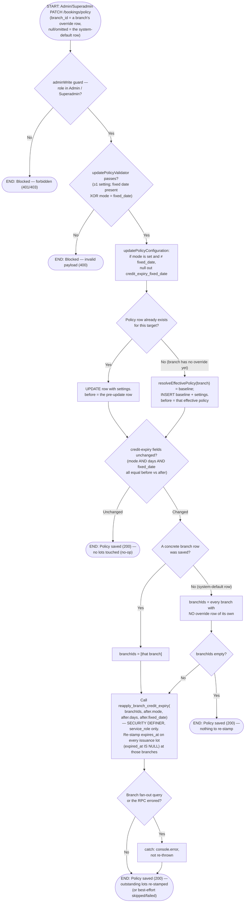

# M10 · Credit-Expiry Policy Change — Retroactive Re-stamp

**Actors:** Admin, Superadmin (Settings → Config → Policies)
**Code:** `server/src/features/booking/services/staffPicker.service.ts`
(`updatePolicyConfiguration`, `reapplyCreditExpiryAfterPolicyChange`),
`server/src/features/booking/modules/validators/booking.validator.ts`
(`updatePolicyValidator`),
`server/src/features/credits/modules/creditExpiry.util.ts`,
`supabase/migrations/20260902159_m10_policy_credit_expiry_mode.sql`
(`reapply_branch_credit_expiry` RPC),
`supabase/migrations/20260902160_m10_credit_expiry_manila_end_of_day.sql`
**Part of:** [[M10-credit-balance-management|M10 · Credit Balance Management]]

"Entire branch credits expire at date X" is meant to cover the credit a
customer _already_ holds, not just future issuances — and the same when an
admin relaxes the rule. So whenever an Admin/Superadmin saves a
credit-expiry policy change (`PATCH /bookings/policy`), the server calls the
`reapply_branch_credit_expiry()` database function to re-stamp `expires_at`
on every not-yet-swept issuance lot at the affected branch(es). This is a
**best-effort** side effect: if it fails, it is logged and the policy still
saves `200`. The daily sweep ([[M10-02-credit-expiry-sweep|M10-02]]) then
acts on the new dates with no changes of its own.

## Notes

- **What the RPC does per mode** (`reapply_branch_credit_expiry`, re-created
  in migration `20260902160` for the Manila-timezone maths): for every
  `credit_transactions` row that is `transaction_type = 'issuance'` and not
  yet swept (`expired_at IS NULL`) at a branch in `p_branch_ids` —
  - `none` → `expires_at = NULL` (that credit now never expires),
  - `rolling` → `expires_at =` end of the Asia/Manila calendar day
    `created_at + p_days` (the lot's _own_ issue date plus the day count, so
    older lots get earlier dates),
  - `fixed_date` → `expires_at =` end of the Manila day `p_fixed_date` (every
    lot at the branch lands on the same date).
- **Which branches are affected.** Saving a branch's own override row touches
  only that branch. Saving the **system-default** row fans out to _every_
  branch that has no override of its own — exactly the set
  `resolveEffectivePolicy()` would hand the default row. That fan-out is the
  chosen reading of "entire branch credits expire at X"; it is not
  forward-only (Open Item in the session record).
- **No-op guard.** The Policies page PATCHes every policy field on every save,
  so `reapplyCreditExpiryAfterPolicyChange` first checks
  `creditExpiryUnchanged(before, after)` (mode **and** days **and** fixed
  date all equal) and returns immediately if nothing credit-expiry-related
  moved — otherwise an unrelated edit (lunch break, notice period…) would
  needlessly re-stamp every branch.
- **Best-effort, never fails the save.** The whole re-stamp is wrapped in a
  `try/catch`; a branches/overrides lookup error or an RPC error is
  `console.error`'d and swallowed, and `PATCH /bookings/policy` still returns
  `200` with the saved row. This mirrors the `#117` precedent where credit
  issuance is not gated on its best-effort log write.
- **`credit_expiry_fixed_date` hygiene.** The validator only rejects a date
  sent _together with_ a non-`fixed_date` mode; a mode change that simply
  omits the date field would leave a stale date on the row, so
  `updatePolicyConfiguration` explicitly nulls `credit_expiry_fixed_date`
  whenever `credit_expiry_mode` is set to anything other than `fixed_date`.
- A `policy_configurations` CHECK constraint
  (`..._credit_expiry_fixed_date_required`) plus the validator `superRefine`
  both enforce "`fixed_date` mode ⇔ a date is set", so the RPC's own
  `p_fixed_date is null` guard for `fixed_date` mode is defence-in-depth.
- The re-stamp only moves `expires_at`. It does **not** itself expire or
  redeem anything — [[M10-02-credit-expiry-sweep|`expire_credits()`]] picks
  up the new dates on its normal schedule (which is also why migration
  `20260902159` had to make that sweep re-read the balance per iteration —
  `fixed_date` makes many same-dated lots the norm).

## Relationship to other modules

The `PATCH /bookings/policy` surface itself is
[[M09-policy-enforcement|M09]] / [[M03-appointment-booking|M03]] territory
(`booking` feature, `staffPicker.service.ts`), shared with the notice-period,
reschedule-fee, and downpayment settings. Issuance-time expiry stamping is
[[M10-01-cancellation-to-credit-conversion|M10-01]]; the customer-visible
result of the new dates surfaces through
[[M10-03-credit-balance-and-history-access|M10-03]]'s `next_expires_*`
enrichment (navbar wallet pill, `/portal/credits`).
