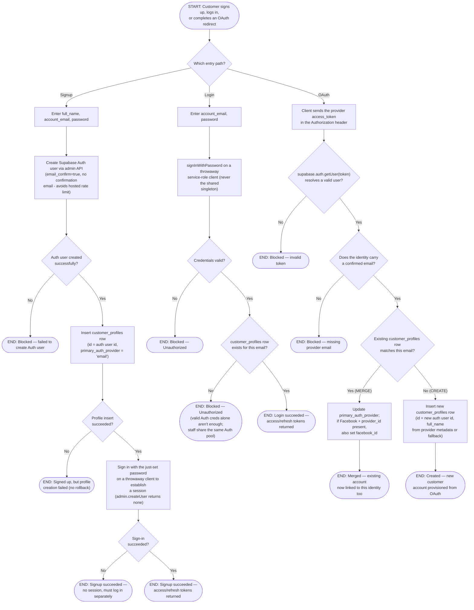

# M02 · Customer Registration, Login & OAuth Account Merge

**Actors:** Customer
**Code:** `server/src/features/auth/customers/customerAuth.controller.ts`,
`server/src/features/auth/customers/services/accountMerge.service.ts`
**Part of:** [[M02-customer-portal-pet-management|M02 · Customer Portal & Pet Management]]

A customer reaches the portal one of three ways — self-registering with
email + password, logging back in with existing credentials, or completing
a Google/Facebook OAuth redirect. All three end with a `customer_profiles`
row in place and a Supabase Auth session issued; the OAuth path additionally
has to decide whether it's looking at a brand-new customer or an existing
one signing in with a second identity provider.

## Notes

- Signup uses the Supabase **admin** `createUser` API rather than
  `auth.signUp`, deliberately, so no confirmation email is sent — the
  hosted project's email rate limit (2/hour) would otherwise fail most
  signups with a 400.
- If the `customer_profiles` insert fails after the Auth user was already
  created, there is **no compensating rollback** here — unlike staff
  account creation ([[M01-01-staff-account-creation|M01]]), which deletes
  the orphaned Auth user on a failed profile insert. A failed customer
  signup can leave a login-capable Auth user with no profile row.
- Login intentionally checks for a matching `customer_profiles` row _in
  addition to_ a valid Supabase Auth session — staff and customers are
  issued from the same Auth pool, so without this check a staff member's
  email/password would also open the customer portal.
- `sign in with password` never runs on the shared service-role `supabase`
  singleton — a dedicated throwaway client is created per call, because
  `signInWithPassword` mutates the calling client's internal session state
  and would otherwise silently downgrade every later request on the
  process to that one customer's RLS-restricted session.
- The OAuth merge/create decision is keyed purely on **email match** —
  `mergeOrCreate` looks up `customer_profiles.account_email`, not any
  provider-specific id. A Facebook login updates `facebook_id` on top of
  whatever provider created the account originally, so one customer can
  end up with both a Google-created profile and a linked Facebook
  identity.
- `MissingProviderEmailError` (422) is a distinct, actionable error class —
  it means the OAuth provider itself never handed Supabase a confirmed
  email for that identity, not an application bug.

## Relationship to other modules

Customer sessions have no inactivity timeout, unlike staff sessions in
[[M01-staff-authentication-access-control|M01]].
