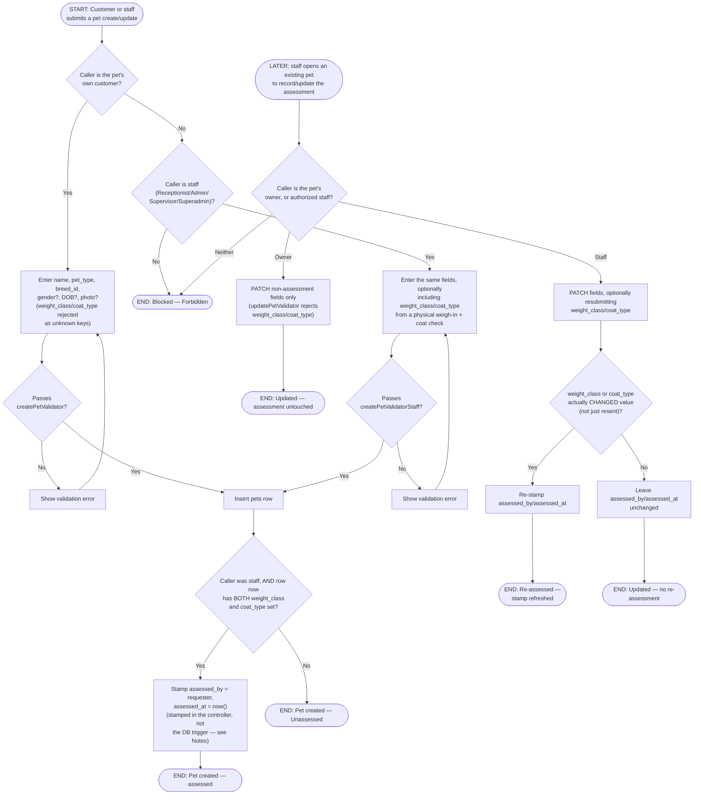

# M02 · Pet Profile Creation & Staff Physical Assessment

**Actors:** Customer, Receptionist, Admin, Supervisor, Superadmin
**Code:** `server/src/features/customers/pets/pet.controller.ts`,
`server/src/features/customers/pets/modules/validators/pet.validator.ts`,
`supabase/migrations/20260802073_m02_pets_assessment_lock.sql`
**Part of:** [[M02-customer-portal-pet-management|M02 · Customer Portal & Pet Management]]

A customer can register their own pet at any time, but two fields —
`weight_class` and `coat_type` — drive Grooming pricing and Hotel cage
assignment downstream, so they can only ever be set by staff who have
physically weighed and inspected the pet onsite. A pet without both fields
stays "Unassessed" until that happens.

## Notes

- The assessment lock is enforced in **two independent layers**: the
  app-layer validator split (`createPetValidator`/`updatePetValidator` vs
  the `...Staff` variants, both `.strict()` so an unexpected key is a clean 400) is the primary, UX-facing gate; a `BEFORE INSERT/UPDATE` trigger
  (`enforce_pet_assessment_writes`) is defense-in-depth at the DB layer.
- The trigger, however, can only fire on a real authenticated (non-staff)
  session — `auth.uid()` resolves to `NULL` for the shared **service-role**
  Supabase client every real write in this codebase actually uses, so in
  practice the trigger is a backstop against a customer's own session
  writing to Postgres directly (bypassing the Express API entirely), not
  against the app's own normal traffic. This required a follow-up fix
  (`...075_m02_pets_assessment_trigger_fix.sql`): the original trigger
  version rejected _every_ staff write too, because it could never tell a
  legitimate service-role staff write from an anonymous one.
- Because the trigger can't identify a service-role caller,
  `assessed_by`/`assessed_at` stamping for the real app path happens in
  **`pet.controller.ts` itself**, not the trigger — `resolveAssessmentStamp`
  only stamps when the pet ends up fully assessed (both fields non-null),
  matching the trigger's original intent.
- On update, the stamp only refreshes if `weight_class` or `coat_type`
  **actually changed value** — the staff edit form resends both fields on
  every save regardless of whether staff touched them, so "the key is
  present" alone doesn't count as a fresh assessment (that would make an
  unrelated name/photo edit look like a re-weigh).
- `NULL` on `weight_class`/`coat_type` means "not yet assessed," not a
  missing/invalid value — chosen over adding a new enum value specifically
  to avoid `ALTER TYPE ... ADD VALUE`'s transaction/ordering quirks.
- Staff creating a pet "on behalf of" a customer (walk-in intake, booking,
  daycare check-in) reuses the exact same `PetForm` component as
  self-service, just with `isStaff=true` unlocking the two assessment
  fields — there is no separate staff-only pet form.
- Breed is a required, type-scoped dropdown (`BreedSelect`) backed by a
  seeded `breeds` lookup table (owned by the maintenance/M13 feature, not
  this one) — there is **no free-text fallback** for an unlisted breed; see
  the discrepancy note against the module summary.

## Relationship to other modules

`weight_class`/`coat_type` feed the Grooming pricing matrix and Hotel cage
assignment in [[M03-appointment-booking|M03]] and
[[M13-maintenance-packages-services-promos|M13]]. Health conditions are
recorded separately by a veterinarian and are out of scope here — see
[[M07-health-veterinary-management|M07]].
