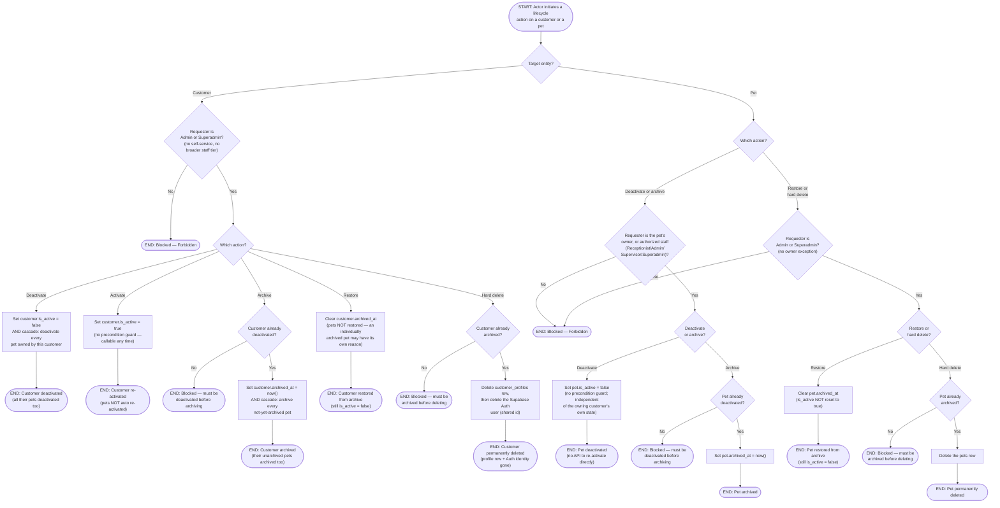

# M02 · Customer & Pet Deactivate → Archive → Hard-Delete Lifecycle

**Actors:** Admin, Superadmin, Customer, Receptionist, Supervisor
**Code:** `server/src/features/customers/customer.controller.ts`,
`server/src/features/customers/services/customerArchive.service.ts`,
`server/src/features/customers/pets/pet.controller.ts`,
`server/src/features/customers/pets/services/petArchive.service.ts`,
`server/src/shared/archive/archiveGuard.ts`
**Part of:** [[M02-customer-portal-pet-management|M02 · Customer Portal & Pet Management]]

Customers and pets each follow the same three-step lifecycle used
elsewhere in the app for Products and Staff: deactivate, then archive,
then permanently delete — each step gated behind the previous one having
actually happened. Customer profiles and pets are gated differently,
though: a customer-level action is Admin/Superadmin only end-to-end, while
a pet's owner (or any front-desk-tier staff) can deactivate or archive it
themselves, and only Admin/Superadmin can restore it from archive or hard
delete it.

## Notes

- Customer-level actions are gated entirely to `CUSTOMER_ARCHIVE_ROLES`
  (Admin/Superadmin) — there is no self-service path and no broader
  `CUSTOMER_MANAGER_ROLES` (Receptionist/Supervisor) exception, unlike most
  other customer/pet endpoints.
- Pet deactivate/archive is gated more loosely: the pet's own owner **or**
  any `CUSTOMER_MANAGER_ROLES` staff (Receptionist, Admin, Supervisor,
  Superadmin) can do it — matching the idea that an owner should be able to
  flag their own pet as deceased/rehomed without needing an admin. Restore
  and hard-delete narrow back down to `CUSTOMER_ARCHIVE_ROLES` only, with
  no owner exception at all.
- `deactivate → archive → hard-delete` is a strict, one-directional
  precondition chain, enforced by the shared `archiveGuard.ts` helpers
  (`assertInactiveBeforeArchive`, `assertArchivedBeforeHardDelete`) used
  identically for Products and Staff elsewhere in the app — you can't skip
  a step, e.g. hard-deleting a still-active customer or pet.
- Deactivating or archiving a **customer** cascades onto their pets (every
  pet gets deactivated, or every not-yet-archived pet gets archived), but
  **restoring** a customer does not cascade back — a pet may have been
  archived independently (e.g. deceased) for a reason unrelated to the
  customer's own account state, so undoing the customer's archive
  shouldn't silently undo the pet's too.
- Deactivating a pet has no corresponding "re-activate" endpoint, and
  restoring an archived pet does **not** flip `is_active` back to `true`
  — a restored pet stays inactive with no API path to re-activate it
  directly (unlike a customer, which does have a dedicated `activate`
  endpoint). This asymmetry is real in the code as read; it isn't
  addressed here further since the module note makes no claim either way.
- Hard-deleting a **customer** also deletes the underlying Supabase Auth
  user, since `customer_profiles.id` and `auth.users.id` are the same
  value — a hard delete removes both the profile row and the login
  identity. A pet hard-delete only removes the `pets` row (pets have no
  Auth identity).
- Customers and pets never had a deactivate/archive concept before this
  feature — unlike Products and Staff, there was no pre-existing
  `is_active` toggle to extend, so this introduces "deactivate" as a new
  first step ahead of the pre-existing archive/delete machinery those
  other entities already used.

## Relationship to other modules

None beyond M02 itself — `related_modules` is empty in the machine file.
