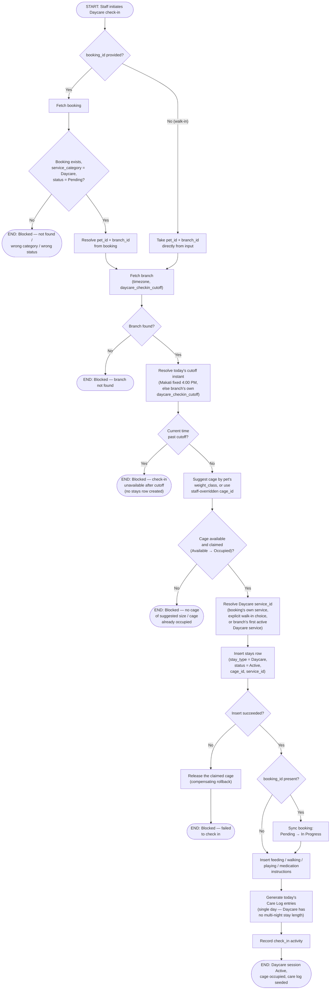

# M06 · Daycare Check-In

**Actors:** Receptionist, Admin, Supervisor, Superadmin, Groomer, Pet Assistant
**Code:** `server/src/features/daycare/services/daycareCheckIn.service.ts`,
`server/src/features/daycare/daycare.controller.ts`,
`server/src/features/hotel/services/cageAssignment.service.ts`,
`server/src/features/hotel/services/careInstructions.service.ts`
**Part of:** [[M06-daycare-management|M06 · Daycare Management]]

A front-desk-capable staff member checks a pet into Daycare, either against
an existing advance booking or as a fresh walk-in. Since the `stays` table
was unified across Hotel and Daycare, this reuses Hotel's own cage-claim and
structured care-instruction machinery rather than any Daycare-specific
capacity model — the two categories differ only in billing and in Daycare
having no scheduled multi-night length.

## Notes

- A failure at **any** point after the cage is claimed — the `stays` insert,
  the care-instruction inserts, or Care Log generation — releases the cage
  back to `Available` via a single `try/catch` wrapping that whole block, so
  a failed check-in never strands an Occupied cage with no session behind
  it.
- The Makati cutoff (4:00 PM) is a hardcoded application constant, not read
  from `branches.daycare_checkin_cutoff` even though that column exists (and
  is seeded identically) on every branch — only Southwoods' branch-config
  value is ever actually read. This is a deliberate, documented asymmetry,
  not a bug.
- Booking-linked check-in is the "service started" event: there is no
  separate Confirmed gate, so a booking must still be `Pending` to be
  checked in, and check-in itself advances it to `In Progress`.
- `service_id` (which Daycare service's fee schedule bills this session)
  is resolved once at check-in and stored on the `stays` row — a
  booking-linked check-in always derives it from the booking's own selected
  service server-side, ignoring any `service_id` sent in the request; only
  a walk-in's explicit choice (or the branch fallback) is honored.
- Groomer and Pet Assistant can check pets in/out of Daycare because Daycare
  has no dedicated assigned-staff role of its own (unlike Grooming or
  Veterinary) — this mirrors Hotel's identical advance-role list.

## Relationship to other modules

Booking-linked check-ins come from [[M03-appointment-booking|M03]]; the
Boarding Checklist Care Log this seeds is shared with
[[M05-pet-hotel-boarding-management|M05]]'s Kanban board.
