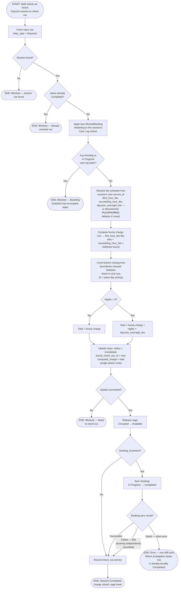

# M06 · Daycare Checkout & Billing

**Actors:** Receptionist, Admin, Supervisor, Superadmin, Groomer, Pet Assistant
**Code:** `server/src/features/daycare/services/daycareBilling.service.ts`,
`server/src/features/hotel/services/careLogCompletion.service.ts`,
`server/src/features/booking/services/availability.service.ts`
**Part of:** [[M06-daycare-management|M06 · Daycare Management]]

Staff check an Active Daycare session out, which gates on the Boarding
Checklist, computes an hourly-plus-overnight charge from the pet's own
service's fee schedule, releases the cage, and best-effort syncs any linked
booking to Completed.

## Notes

- The Boarding Checklist gate (`assertChecklistComplete`) excludes both
  **Missed** (a terminal state nobody can act on, from an earlier day) and
  **Backlog** (a future-dated task not due yet) from blocking checkout —
  only `Pending`/`In Progress` tasks block. This is the same gate Hotel
  checkout uses, since Daycare shares `care_log_entries` on the unified
  `stays` table.
- The hourly charge rounds any partial succeeding hour up to a full billable
  hour (e.g. 1h10m → 2 billable hours). The implementation's own code
  comments flag a discrepancy with the requirements doc's worked example for
  2h15m (doc claims ₱250; the formula as implemented, and as covered by
  tests, computes ₱200) — see `daycareBilling.service.ts` for the reviewer
  note. This is a spec-vs-code mismatch already flagged in the codebase
  itself, not something introduced by this doc.
- The overnight fee is charged **per branch closing-time boundary crossed**,
  not per literal calendar night — a session that spans two closes (e.g.
  picked up two days late) is charged for two nights, and a same-day pickup
  before closing is charged zero nights.
- Fee figures were moved off a single admin-wide `pricing_configuration`
  setting and onto each Daycare-type `services` row
  (`first_hour_fee`/`succeeding_hour_fee`/`daycare_overnight_fee`) — this is
  the overnight-vs-daytime pricing decision point: whichever service the
  session is billed against determines its own rates, falling back to the
  documented ₱100/₱50/₱850 defaults only when the service (or its fee
  columns) can't be resolved.
- No real transaction/billing-ledger call happens at checkout —
  `computed_charge` is simply stored and queryable on the `stays` row; a
  `TODO` in the service notes this is meant to post to
  [[M08-sales-billing|M08]] as a real line item once that module exists.
- If the linked booking was independently cancelled between check-in and
  checkout, `completeBooking` throws a 409 that checkout deliberately
  swallows — the `stays` row being Completed is treated as the authoritative
  record that the physical checkout happened, so a stale booking-side
  conflict does not block it. Any other error from the booking sync still
  propagates.

## Relationship to other modules

`computed_charge` is a placeholder pending real posting to
[[M08-sales-billing|M08]]. Checkout gating reuses the Boarding Checklist
shared with [[M05-pet-hotel-boarding-management|M05]], and syncs back to
[[M03-appointment-booking|M03]] bookings when the session was booking-linked.
