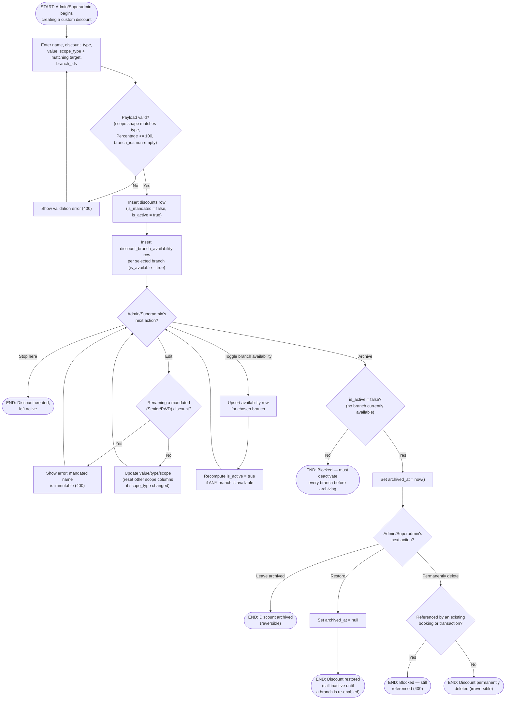

# M12 · Discount Creation, Branch Availability & Archive Lifecycle

**Actors:** Admin, Superadmin
**Code:** `server/src/features/discounts/services/discounts.service.ts`,
`server/src/features/discounts/discounts.controller.ts`,
`server/src/features/discounts/modules/validators/discounts.validator.ts`
**Part of:** [[M12-discount-management|M12 · Discount Management]]

An Admin or Superadmin defines a custom, standing discount (percentage or
flat) scoped to a service, package, or category, then later manages it
through its lifecycle — editing, toggling per-branch availability, archiving,
restoring, or permanently deleting it. This same CRUD path is also how
Admins manage the seeded Senior Citizen / PWD statutory rows (see
[[M12-02-discount-eligibility-calculation-and-application|M12-02]] for how a
discount actually gets applied to a sale).

## Notes

- `is_active` is **fully derived** from `discount_branch_availability`, not
  an independent switch — it's true whenever at least one branch has
  `is_available = true`, false otherwise. `updateDiscount` no longer accepts
  `is_active` at all; the only way to deactivate a discount everywhere is to
  turn off every branch via `setDiscountBranchAvailability`. This supersedes
  the original schema comment (migration `...033`) that discounts "default
  to `is_active = false`" — `createDiscount` now always inserts
  `is_active: true` because `branch_ids` is required to be non-empty, so a
  newly created discount is always live somewhere from the moment it's
  created. See the discrepancy called out in the module note's Notes
  section.
- `is_mandated` can never be set through this API — `.strict()` on both the
  create and update Zod schemas rejects the key outright. The two mandated
  rows (Senior Citizen Discount, PWD Discount) exist only via a one-time
  seed script, one row per service category (8 rows total), each seeded
  **available at every branch and therefore active** from the start — not
  "switched off by default."
- A mandated row's _name_ is immutable (blocks a rename attempt with a 400),
  but its value, scope, and branch availability can still be edited/archived
  like any custom discount — `is_mandated` only protects identity, not
  lifecycle.
- Archiving requires deactivating first (403 otherwise); hard-deleting
  requires archiving first (403 otherwise) and fails with 409 if the
  discount is still referenced by a booking or a transaction — the same
  deactivate → archive → hard-delete shape used elsewhere in this codebase
  (Products, Staff, Customers, Pets, Promos, Packages).

## Relationship to other modules

Scope targets (`scope_service_id`, `scope_package_id`, `scope_category`)
reference the service/package catalog configured under
[[M13-maintenance-packages-services-promos|M13]]. Discounts created or
toggled here are what
[[M12-02-discount-eligibility-calculation-and-application|M12-02]]
evaluates at booking time and checkout.
