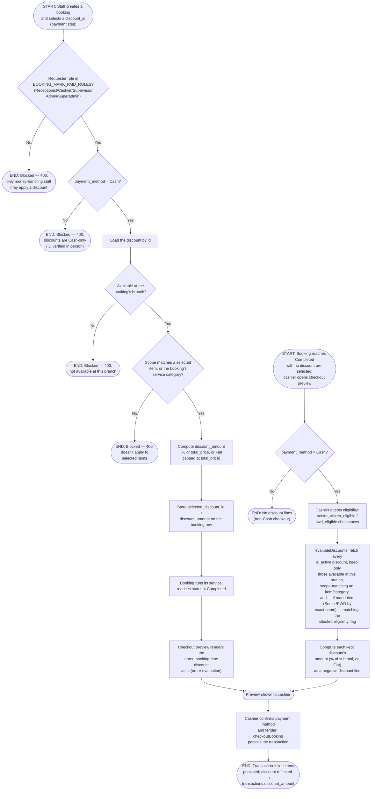

# M12 · Discount Eligibility Calculation & Application

**Actors:** Receptionist, Cashier, Supervisor, Admin, Superadmin (booking-time
selection); Cashier and other money-handling staff (checkout-time
auto-evaluation)
**Code:** `server/src/features/booking/services/booking.service.ts`
(`resolveDiscountAndPromo`), `server/src/features/billing/services/discountPromoEvaluation.service.ts`
(`evaluateDiscounts`), `server/src/features/billing/services/checkoutAggregation.service.ts`,
`server/src/features/billing/services/lineItemSources.service.ts`
**Part of:** [[M12-discount-management|M12 · Discount Management]]

A discount created under [[M12-01-discount-creation-and-lifecycle|M12-01]] gets
applied to a real sale in one of two ways: staff can lock one in at booking
creation (Cash-only, staff physically verified an ID), or — if nothing was
pre-selected — the cashier's checkout screen auto-evaluates every active
discount against the completed booking's scope and, for the Senior/PWD
statutory rows, an onsite eligibility attestation.

## Notes

- These are genuinely two separate evaluation paths, not one function reused
  twice: `resolveDiscountAndPromo` (booking creation) actively rejects an
  invalid selection with a 400/403 — it's a validated staff choice.
  `evaluateDiscounts` (checkout) is a silent filter — a discount that doesn't
  match scope, branch, or eligibility is simply left out, with no error
  surfaced. The Mermaid diagram reflects this: booking-time gets explicit
  `END: Blocked` outcomes, checkout-time does not.
- If a booking already has a `selected_discount_id` (locked in at creation),
  checkout deliberately renders that stored line **as-is** instead of
  re-running `evaluateDiscounts` — the code comment in
  `checkoutAggregation.service.ts` explains this is to avoid two independent
  evaluations of the same rules disagreeing at the register. A booking with
  nothing pre-selected (created before this feature, via a direct API call,
  or a Veterinary follow-up copy) falls through to the auto-evaluate path.
- The Senior/PWD eligibility flags (`senior_citizen_eligible`,
  `pwd_eligible`) are a same-transaction staff attestation (a checkbox the
  cashier or booking staff ticks after checking an ID in person) — there is
  no separate customer eligibility record or ID-scan verification in the
  code; matching a mandated row is done by exact discount name
  (`'Senior Citizen Discount'` / `'PWD Discount'`), which is safe only
  because `updateDiscount` already blocks renaming a mandated row (see
  [[M12-01-discount-creation-and-lifecycle|M12-01]]).
- Multiple discounts can combine on one booking at checkout time (per-item
  scoping means several items can each carry their own matching discount);
  the booking-time path, by contrast, only ever locks in **one**
  `discount_id`.
- **Active/inactive status:** despite `AGENTS.md` describing the Discount
  Module as "(currently inactive)" and this module note (`M12-discount-management.md`)
  stating discounts are "inactive by default," the code for this workflow is
  fully wired end-to-end: `discounts.routes.ts` is mounted in
  `app.routes.ts`, the booking wizard's payment step has a live discount
  picker gated on the same Cash/staff-role rule, `CashierCheckoutPage.tsx`
  has live Senior/PWD attestation checkboxes, and `evaluateDiscounts` runs
  as part of every real checkout. This is the same discrepancy already
  flagged in M12-01's Notes (the module note's "inactive by default" claim
  looks stale relative to `is_active` always being true from creation) —
  not resolved here, just corroborated from the consumer side.

## Relationship to other modules

Reads bookings from [[M03-appointment-booking|M03]] (booking-time selection)
and is invoked from [[M08-sales-billing|M08]]'s checkout preview/confirm flow;
the discounts it evaluates are configured under
[[M12-01-discount-creation-and-lifecycle|M12-01]].
