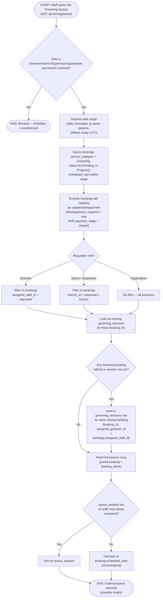

# M04 · Grooming Queue Population & Visibility

**Actors:** Groomer, Admin, Supervisor, Superadmin
**Code:** `server/src/features/grooming/services/grooming.service.ts`,
`server/src/features/grooming/grooming.controller.ts`,
`server/src/features/grooming/grooming.routes.ts`
**Part of:** [[M04-grooming-management|M04 · Grooming Management]]

A staff member opens the Grooming Queue; the server resolves which
not-yet-finished Grooming bookings are visible to them, lazily creates a
`grooming_sessions` row for any that don't have one yet, and orders the
result. There is no database trigger that creates these rows — the queue
endpoint itself is the only thing that vivifies them.

## Notes

- The queue's date filter defaults to **today** when neither `date_from`
  nor `date_to` is supplied — every existing caller relies on this, so it
  isn't just a UI default, it's baked into the service function itself.
- `grooming_sessions` rows are created lazily, on read, not by a trigger
  or at booking-creation time — this keeps the queue working without
  touching `booking.service.ts` at all. A booking that never gets viewed
  through the queue simply never gets a session row (harmless, since the
  row exists only to support queue display/ordering, not billing).
- The downpayment gate (`downpayment_required = false OR payment_stage <>
'Unpaid'`) is evaluated in the same query that selects candidate
  bookings — a booking failing it is invisible to the queue and never
  gets a `grooming_sessions` row vivified, not merely hidden after the
  fact.
- Role scoping is three-tiered: Groomer sees only sessions assigned to
  them, Admin/Supervisor are branch-scoped, and Superadmin is
  unrestricted (all branches) — mirroring the pattern used by other
  execution queues in this app.
- Sorting is per-pair: `queue_position` wins only when **both** rows
  being compared have one set; a row with no `queue_position` falls back
  to its booking's `scheduled_start`, so an explicit manual reorder
  (`queue_position`) and the default chronological order can coexist in
  the same list.
- `grooming_sessions.assigned_groomer_id` is a denormalized copy of
  `bookings.assigned_staff_id` taken at vivification time — it exists so
  the Groomer's "my sessions" query doesn't need to join through
  `bookings`, not as a second source of truth for who's assigned.

## Relationship to other modules

Reads booking state owned by [[M03-appointment-booking|M03]] (status,
`assigned_staff_id`, downpayment fields) and staff role/branch from
[[M01-staff-authentication-access-control|M01]].
