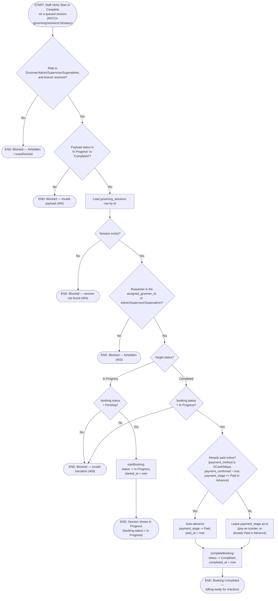

# M04 · Grooming Session Execution & Billing Handoff

**Actors:** Groomer (assigned), Admin, Supervisor, Superadmin; Cashier/
Receptionist (downstream, at checkout)
**Code:** `server/src/features/grooming/services/grooming.service.ts`,
`server/src/features/grooming/grooming.controller.ts`,
`server/src/features/booking/services/booking.service.ts`,
`server/src/features/billing/services/lineItemSources.service.ts`
**Part of:** [[M04-grooming-management|M04 · Grooming Management]]

The assigned groomer (or a branch manager) advances a queued session
through Start and Complete. `grooming_sessions` carries no execution
state of its own — both actions dispatch straight to the shared
booking-status transitions (`startBooking`/`completeBooking`), and it's
that underlying `bookings.status` flip to `Completed` that makes the
booking billing-ready.

## Notes

- `grooming_sessions` no longer tracks its own Waiting/In Progress/
  Completed state or `started_at`/`completed_at` — a follow-up migration
  (`...059`) dropped those columns. The joined `booking.status` (and its
  own `started_at`/`completed_at`) is the single source of truth; the
  session row itself is now just a queue/authorization record
  (`assigned_groomer_id`, `queue_position`).
- Authorization is unchanged by that revision: **the assigned groomer**,
  or an **Admin/Supervisor/Superadmin manager**, can transition a
  session — any other groomer gets a 403 even if they're at the same
  branch. The check reads `assigned_groomer_id` off the session row, not
  off the booking.
- Invalid transitions (e.g. completing a Pending booking, or starting an
  already-Completed one) aren't re-validated by the grooming service —
  it delegates to `startBooking`/`completeBooking` and lets their 409s
  propagate untouched. Reading only `grooming.service.ts` would suggest
  there's no transition-guard at all.
- The online-prepaid fast path (`completeBooking`) only fires when the
  booking is at `payment_stage <> 'Paid in Advance'` — a booking that
  already collected a downpayment online still owes a remaining balance,
  so Completing it does **not** blindly jump `payment_stage` to `Paid`.
  Every pay-at-counter booking (Cash/Card/Bank Transfer/Grabmart/
  Pickaroo, or an online booking never actually confirmed) lands on
  Completed with `payment_stage` untouched, left for a cashier to advance
  later.
- Checkout (`getBookingForBilling` in the billing feature) refuses to run
  against any booking whose `status` isn't `Completed` — this workflow's
  end state is what unlocks it, not a separate "ready for billing" flag.
  For Grooming, `getServiceLineItems` bills every selected `booking_items`
  row directly (`getItemBasedLineItems`) plus a negative "Downpayment
  already collected" line when `downpayment_required` was true — there is
  no Grooming-specific price recalculation at checkout.
- The route-level guard (`GROOMING_QUEUE_ROLES`: Groomer, Admin,
  Supervisor, Superadmin) is broader than the service-layer per-session
  check — Cashier is excluded from even attempting Start/Complete on a
  grooming session at the route, matching the app-wide "Cashier only
  handles payment, never the service lifecycle" rule.

## Relationship to other modules

Booking status transitions themselves live in
[[M03-appointment-booking|M03]] (`startBooking`/`completeBooking`); a
Completed Grooming booking becomes billable through
[[M08-sales-billing|M08]]'s checkout, which is the only consumer of the
`Completed` status this workflow produces.
