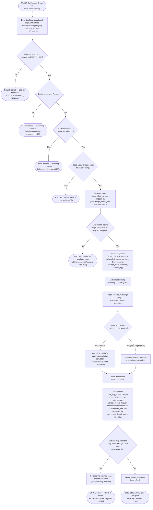

# M05 · Hotel Check-In

**Actors:** Receptionist, Groomer, Pet Assistant, Admin, Supervisor, Superadmin (`HOTEL_ADVANCE_ROLES`)
**Code:** `server/src/features/hotel/services/careInstructions.service.ts`,
`server/src/features/hotel/services/cageAssignment.service.ts`,
`server/src/features/hotel/hotel.controller.ts`
**Part of:** [[M05-pet-hotel-boarding-management|M05 · Pet Hotel (Boarding) Management]]

A front-desk or advance-role staff member checks a confirmed Hotel booking
in on its scheduled day: the system claims a cage, writes the stay's
structured feeding/walking/playing/medication instructions, and
auto-generates one Boarding Checklist entry per scheduled action per day of
the stay.

## Notes

- Cage capacity has no separate reservation table — a cage's `status`
  column _is_ the capacity signal. Claiming a cage is a conditionally-guarded
  `UPDATE ... WHERE status = 'Available'`, not a real DB transaction (the
  Supabase client here has no cross-table transaction); a race between two
  concurrent check-ins for the last cage of a size resolves to one winner,
  the other gets a 409.
- This whole flow (from the stay insert through Care Log generation) is
  wrapped in a single try/catch in application code, not a DB transaction —
  a failure at _any_ point in that range releases the cage rather than
  leaving it stranded Occupied with no `stays` row behind it.
- Medications is the only care-instruction field with omit-vs-empty-array
  semantics: omitting it entirely triggers auto-fill from the pet's current
  prescription ([[M07-health-veterinary-management|M07]]); submitting `[]`
  explicitly means "no medications," verbatim, with no prescription lookup.
- A medication's `scheduled_times` are bucketed into the same
  Morning/Noon/Afternoon/Evening `time_block` vocabulary feeding/walking/
  playing use (hour < 11 → Morning, < 13 → Noon, < 17 → Afternoon, else
  Evening), so the Boarding Checklist can group every care type consistently.
- Physical check-in — not booking confirmation — is what advances the
  booking from Pending to In Progress. A booking that's already In Progress
  or further along cannot be checked in again.

## Relationship to other modules

Depends on a Hotel booking already existing ([[M03-appointment-booking|M03]])
and, when medications are omitted, on [[M07-health-veterinary-management|M07]]'s
current-prescription lookup. Feeds the Boarding Checklist covered by
[[M05-02-boarding-checklist-task-lifecycle|M05 · Boarding Checklist Task Lifecycle]].
