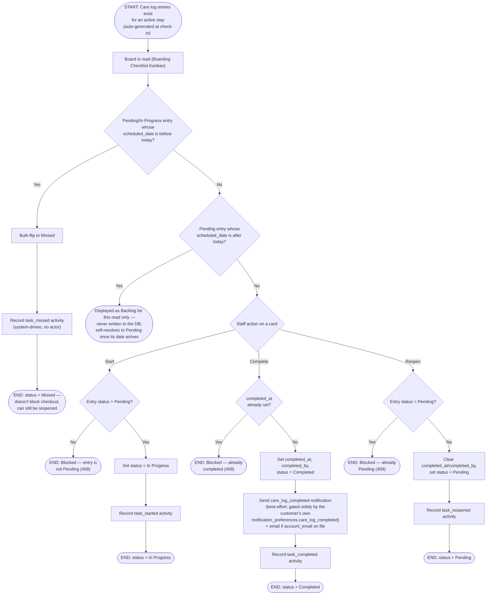

# M05 · Boarding Checklist Task Lifecycle

**Actors:** Receptionist, Groomer, Pet Assistant, Admin, Supervisor, Superadmin
(`HOTEL_ADVANCE_ROLES`); the system itself for the lazy Missed transition
**Code:** `server/src/features/hotel/services/careLogCompletion.service.ts`,
`server/src/features/hotel/services/careLogNotifications.service.ts`
**Part of:** [[M05-pet-hotel-boarding-management|M05 · Pet Hotel (Boarding) Management]]

Each feeding/walking/playing/medication row [[M05-01-hotel-check-in|check-in
generates]] becomes a Kanban card any advance-role staff member can move
through Pending → In Progress → Completed, or reopen. There is no
scheduled job in this app — a card's Missed/Backlog labeling happens lazily,
computed the moment the board is read, not written by a background process.

## Notes

- `Missed` and `Backlog` are asymmetric: Missed is a real, persisted status
  transition (a bulk `UPDATE`) fired the moment a stale Pending/In Progress
  row is next read by _any_ caller (`getCareLogEntries` or the checkout
  gate's `assertChecklistComplete`); Backlog is a display-only relabeling of
  a still-`Pending` row scheduled for a future date — the stored column
  never changes, so it needs no reverse transition either.
- Missed is not terminal — `reopenCareLogEntry` accepts any status other
  than Pending, Missed included, so a mistakenly-flipped or genuinely-missed
  task can still be brought back to Pending.
- `completeCareLogEntry` does not require the entry to currently be In
  Progress — its only guard is `completed_at IS NULL` — so a card can be
  completed directly from Pending, matching a drag straight to the
  Completed column.
- The `care_log_completed` notification is gated purely by the customer's
  own notification preference now — there is no per-stay "owner opted in"
  staff checkbox anymore (see [[M11-notification|M11]]).
- Missed entries never block checkout; Backlog entries never block it
  either, since a future-dated task was never going to happen by today's
  checkout anyway — see
  [[M05-03-hotel-checkout|M05 · Hotel Checkout]]'s checklist gate, which
  only treats Pending/In Progress as outstanding.

## Relationship to other modules

Completion fires a customer notification/email via
[[M11-notification|M11]]. Outstanding (Pending/In Progress) entries gate
[[M05-03-hotel-checkout|M05 · Hotel Checkout]].
