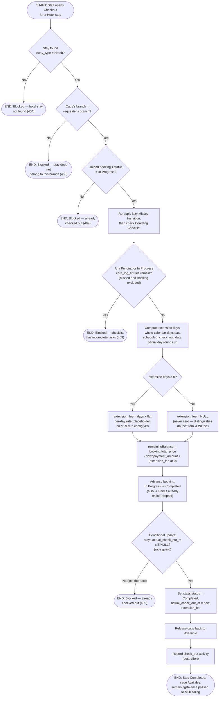

# M05 · Hotel Checkout

**Actors:** Receptionist, Groomer, Pet Assistant, Admin, Supervisor, Superadmin
(`HOTEL_ADVANCE_ROLES`)
**Code:** `server/src/features/hotel/services/checkout.service.ts`,
`server/src/features/hotel/services/careLogCompletion.service.ts`
**Part of:** [[M05-pet-hotel-boarding-management|M05 · Pet Hotel (Boarding) Management]]

Staff check a pet out of a Hotel stay once its Boarding Checklist has no
actionable tasks left. The system calculates any late-checkout extension
fee, reconciles the stay's total cost against the downpayment already
collected, advances the booking to Completed, and releases the cage.

## Notes

- The Boarding Checklist gate excludes both terminal-ish statuses deliberately: Missed tasks can't block a stay forever over something nobody can still act on, and Backlog tasks (scheduled for a day after today) were never going to happen before this checkout anyway. Only Pending/In Progress is "outstanding." See [[M05-02-boarding-checklist-task-lifecycle|M05 · Boarding Checklist Task Lifecycle]].
- The extension fee is a flat ₱500-per-day placeholder
  (`EXTENSION_FEE_PER_DAY` in `checkout.service.ts`) — the code comments
  flag this explicitly as standing in for a real
  [[M09-policy-enforcement|M09]] rate configuration that doesn't exist yet.
- `completeBooking()` is called _before_ the conditional `stays` update on
  purpose: an illegal booking-status transition (e.g. a booking that was
  never actually started) fails fast without mutating `stays` at all.
  `completeBooking` itself isn't atomic against a second concurrent
  checkout call for the same stay — the real single-writer guarantee is the
  conditional `UPDATE stays ... WHERE actual_check_out_at IS NULL` that
  follows it; only the request that wins that race goes on to release the
  cage and return a result.
- Reconciliation is billing-ready only — no `transactions` row is created
  here; the computed `remainingBalance` is handed off to
  [[M08-sales-billing|M08]].

## Relationship to other modules

Advances the underlying booking via [[M03-appointment-booking|M03]]'s
booking-status machinery, hands the remaining balance to
[[M08-sales-billing|M08]], and its extension-fee rate is intended to move to
[[M09-policy-enforcement|M09]] configuration.
