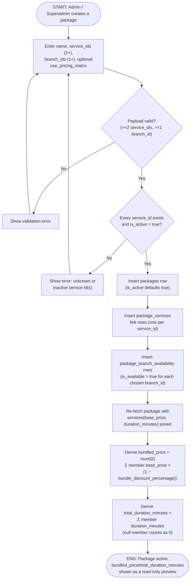

# M13 · Package Creation & Bundled-Price Derivation

**Actors:** Admin, Superadmin
**Code:** `server/src/features/maintenance/services/packages.service.ts`,
`server/src/features/maintenance/services/packagePricing.service.ts`,
`server/src/features/maintenance/utils/deriveBundledPrice.ts`,
`server/src/features/maintenance/utils/derivePackageDuration.ts`,
`server/src/features/maintenance/modules/validators/maintenance.validator.ts`
**Part of:** [[M13-maintenance-packages-services-promos|M13 · Maintenance (Packages, Services & Promos)]]

An Admin or Superadmin bundles two or more existing services into a named
package, picks which branches carry it, and the system derives the
package's price and total duration from its member services rather than
accepting either as manual input.

## Notes

- `bundled_price` and `total_duration_minutes` are **never stored columns**
  — every read (list, get-by-id, archived list) re-derives them from the
  member services' current `base_price`/`duration_minutes` and the
  singleton `package_pricing_configuration` row (`bundle_discount_percentage`,
  Admin-editable separately). Editing a member service's price after the
  fact silently changes every package that includes it, with no
  re-confirmation step.
- An empty service list derives `bundled_price = 0`, not an error — but the
  validator's `min(2)` on `service_ids` means this only matters for the
  zero-service _empty state_ the client shows before any services are
  picked, not a real created package.
- A service deactivated **after** being bundled is not retroactively
  rejected — `assertServicesExistAndActive` only runs at create time and
  whenever `service_ids` is replaced on update. The package keeps the
  reference; `package_services.service_id` is `ON DELETE RESTRICT`, so a
  hard delete of that service (not just deactivation) is what's actually
  blocked.
- Unlike Services and Service Types, a new package does **not** default to
  "available everywhere" — the admin explicitly picks the starting
  `branch_ids`, since the entire point of per-branch packages is selective
  multi-branch offering, not blanket availability.
- `is_active` is not an independent input on create or update — it's kept
  in sync only by `setPackageBranchAvailability` (a separate endpoint):
  active whenever at least one branch is available, inactive when none
  are. A package must be unavailable at every branch before it can be
  archived (`assertInactiveBeforeArchive`).
- `use_pricing_matrix` (off by default) makes a package's _per-pet_ price at
  booking time run its own `bundled_price` through the same weight/coat
  rule engine a Grooming service uses — independent of any member service's
  own flag, and always ignored for a Cat. That booking-time resolution
  (`resolvePackagePrice`) lives in `booking.service.ts`, outside this
  workflow's scope.

## Relationship to other modules

Packages and their derived pricing are consumed at booking time by
[[M03-appointment-booking|M03]]'s `resolvePackagePrice`, and in
[[M08-sales-billing|M08]] billing/downpayment netting. Downpayment itself
is a per-transaction [[M09-policy-enforcement|M09]] policy field now, not
a package attribute.
