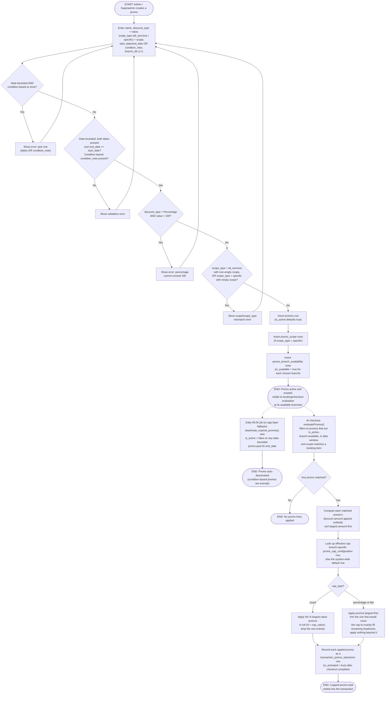

# M13 · Promo Creation, Branch Availability & Per-Transaction Cap Evaluation

**Actors:** Admin, Superadmin (creation/configuration); system (cap
evaluation at checkout)
**Code:** `server/src/features/maintenance/services/promos.service.ts`,
`server/src/features/maintenance/services/promoCap.service.ts`,
`server/src/features/maintenance/modules/validators/maintenance.validator.ts`,
`server/src/features/billing/services/discountPromoEvaluation.service.ts`
**Part of:** [[M13-maintenance-packages-services-promos|M13 · Maintenance (Packages, Services & Promos)]]

An Admin or Superadmin creates a time-limited or condition-based promo
scoped to specific services/packages or all of them, and picks which
branches carry it. Separately, an Admin/Superadmin configures a
per-branch (or system-wide default) cap on how much combined promo
discount one transaction may receive. This doc follows both halves end
to end: promo creation, and how that cap is actually applied when a
booking is priced.

## Notes

- **Discrepancy vs. the M13 module note:** the module note describes promo
  application as customer-driven — "Customers see every promo they're
  currently eligible for, each with its own activation toggle defaulting
  off," applied "in customer-activation order." The actual code
  (`evaluatePromos` in `discountPromoEvaluation.service.ts`) has **no
  customer-facing activation step at all** — every active, in-window,
  scope-matching promo is auto-applied, and `transaction_promo_selections`
  rows are written with `is_activated: true` only _after_ checkout, purely
  as a record of what was applied. There is no code path that reads or
  writes `is_activated: false`, and application order is **largest discount
  amount first**, not activation order. `transaction_promo_selections` was
  originally added schema-only ("the checkout UI itself is M08 scope... not
  built yet" — migration `20260726049`) and a customer toggle may simply
  not have shipped yet; flagged for the user to confirm which is stale, the
  module note or the implementation.
- **Discrepancy vs. the M13 module note:** the note describes the cap as
  "pesos or percentage" only. The code and validator support a third
  `cap_type`, `'count'` (added by migration `20260818132`), which caps the
  _number_ of combinable promos rather than a monetary amount — the
  largest-value promos up to that count apply in full, the rest are dropped
  entirely (no partial trimming, unlike percentage/flat).
- A promo is either date-bounded (`start_date` + `end_date`) or
  condition-based (`condition_note`) — never both, and `condition_note` is
  admin-reference text only, never machine-evaluated at checkout.
- `is_active` is **not** kept in sync with branch availability the way it
  is for Services/Packages/Service Types — a promo's `is_active` also
  drives automatic date-based expiry, so it stays a separately-settable
  flag, manually or via the expiry job.
- Cap evaluation only ever reads `promo_cap_configuration`; it never writes
  to it. The Admin/Superadmin-configured cap itself (`upsertPromoCapConfiguration`)
  is upserted by `branch_id` (NULL = the system-wide default), one row per
  branch plus one default, matching the `policy_configurations` pattern.

## Relationship to other modules

Cap evaluation and promo application execute inside
[[M08-sales-billing|M08]]'s checkout/billing pipeline
(`discountPromoEvaluation.service.ts`, `checkoutAggregation.service.ts`),
not in this feature's own code — this doc documents the M13-owned
configuration and the M08-owned consumption together since neither half
makes sense without the other.
