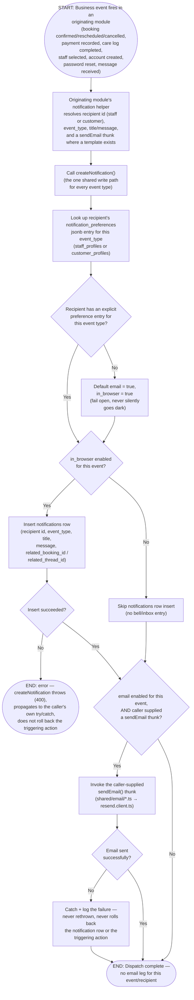

# M11 · Event-Triggered Notification Dispatch

**Actors:** System (any event-producing module), Staff, Customer (recipients)
**Code:** `server/src/features/notifications/services/notification.service.ts`,
`server/src/features/booking/services/bookingNotifications.service.ts`,
`server/src/features/staff/services/staffManagement.service.ts`,
`server/src/shared/email/resend.client.ts`
**Part of:** [[M11-notification|M11 · Notification]]

A business event elsewhere in the app (a booking is confirmed, rescheduled,
cancelled; a payment is recorded; a care log is completed; a staff member is
picked as preferred; an account is created; a password reset is requested)
calls the one shared `createNotification()` write path, which independently
gates an in-app inbox row and a best-effort email against the recipient's own
per-event `notification_preferences`.

## Notes

- `createNotification()` (`notification.service.ts`) is the single call
  every event-triggering module goes through — `bookingNotifications.service.ts`
  (booking_confirmed/rescheduled/cancelled, staff_assigned),
  `staffManagement.service.ts` (account_created), the appointment-reminder
  poller (appointment_reminder), and care-log/messaging code all call the
  same function rather than each reimplementing the preference check.
- The two channels are gated **independently**: muting `in_browser` for an
  event still lets the email send, and vice versa. A recipient row with no
  `notification_preferences` entry for a given event type (shouldn't happen
  in practice — every event type ships a default in the column's migration)
  defaults **both** channels on rather than silently dropping the
  notification.
- The email leg's failure handling lives _inside_ `createNotification` itself
  — a rejected `sendEmail()` thunk is always caught and logged there, never
  rethrown. The in-app row's insert failure is **not** caught internally; it
  throws and relies on the caller wrapping the whole `createNotification()`
  call in its own try/catch (every current call site does this), which is
  what actually makes the entire dispatch best-effort from the triggering
  action's point of view.
- `password_reset` is the one event type with no `sendEmail` thunk wired up
  at any call site — no Resend template exists for it, so that event only
  ever produces the in-app row.
- `related_thread_id` is populated only for `message_received` (the
  messaging/announcements feature's own call into this same function) —
  every other event type leaves it null.

## Relationship to other modules

Called from [[M01-staff-authentication-access-control|M01]] (account_created),
[[M03-appointment-booking|M03]] (booking_confirmed/rescheduled/cancelled,
staff_assigned), [[M05-pet-hotel-boarding-management|M05]]
(care_log_completed), [[M08-sales-billing|M08]] (payment_confirmed), and the
messaging/announcements feature (message_received) as event sources.
