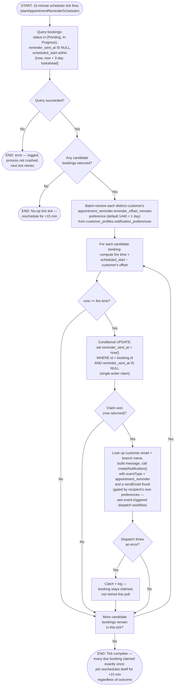

# M11 · Appointment-Reminder Polling Sweep

**Actors:** System (in-process scheduler)
**Code:** `server/src/features/notifications/services/appointmentReminder.job.ts`,
`server/src/features/notifications/services/notification.service.ts`,
`server/src/shared/email/appointmentReminderEmail.ts`
**Part of:** [[M11-notification|M11 · Notification]]

Every 15 minutes an in-process scheduler scans upcoming bookings for any due
an `appointment_reminder`, honoring each customer's own configurable lead
time, and claims each booking with a single-writer conditional update so a
reminder is never sent twice even if two polls overlap.

## Notes

- `reminder_sent_at` is claimed with a **conditional UPDATE**
  (`.eq('id', booking.id).is('reminder_sent_at', null)`), not a plain
  `SELECT` + `UPDATE` — if a concurrent run already claimed the same booking
  between the initial query and this update, the conditional update returns
  no row and this poll simply skips it. This is the single-writer pattern
  that guarantees exactly-once delivery even with overlapping ticks.
- The claim happens **before** the notification is sent, not after — a
  booking whose downstream `createNotification()` call fails (e.g. the
  customer row lookup errors) is still marked as claimed and will not be
  retried on a later poll. The reminder is "sent" from the dedupe column's
  perspective the moment the claim succeeds, independent of whether the
  in-app/email dispatch itself actually completed.
- The lookahead window (3 days) has to reach at least as far as the widest
  configurable offset preset (2 days / 2880 minutes) so a booking's fire time
  is ever inside the query's range in the first place; the poll interval (15
  minutes) matches the finest offset preset (15 minutes) so no reminder
  window is ever missed between ticks.
- A booking whose customer has disabled **both** notification channels for
  `appointment_reminder` is still claimed exactly once at its fire time —
  the preference check happens one layer down, inside
  `createNotification()`, not before the claim.
- A whole-tick failure (the initial query itself erroring) and any
  individual booking's send failure are both caught and logged without
  crashing the scheduler process — the next 15-minute tick picks up the
  slack either way.

## Relationship to other modules

Sources bookings from [[M03-appointment-booking|M03]] and reads each
customer's reminder-timing preference from
[[M02-customer-portal-pet-management|M02]]'s Settings > Preferences. Dispatch
of the actual reminder goes through the same
[[M11-01-event-triggered-notification-dispatch|event-triggered notification
dispatch]] workflow as every other event type.
