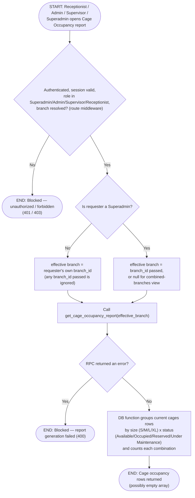

# M14 · Cage Occupancy Report Generation

**Actors:** Receptionist, Admin, Supervisor, Superadmin
**Code:** `server/src/features/reports/reports.controller.ts`,
`server/src/features/reports/reports.routes.ts`,
`server/src/features/reports/services/cageOccupancy.service.ts`,
`supabase/migrations/20260805101_m14_create_reporting_functions.sql`
**Part of:** [[M14-report-management|M14 · Report Management]]

A Receptionist, Admin, Supervisor, or Superadmin opens the Cage Occupancy
report to get a live count of every cage's status, grouped by size tier;
the result is computed directly off the current `cages` table, not a
snapshot or cached rollup.

## Notes

- No date or date-range input exists for this report — it always reflects
  the current state of the `cages` table at the moment of the call.
- Same branch-scoping convention as the Daily Sales Report: Admin/
  Supervisor/Receptionist are pinned to their own branch regardless of
  any `branch_id` they pass; only a Superadmin can request a specific
  other branch or omit `branch_id` for a combined view across branches.
- Receptionist access here is a **later addition** (`CAGE_OCCUPANCY_READ_ROLES`)
  distinct from `REPORTS_READ_ROLES` (Superadmin/Admin/Supervisor), which
  still gates the DSR and Analytics endpoints — Receptionists cannot see
  those two.
- `get_cage_occupancy_report()` returns a plain row set (`size`, `status`,
  `cage_count`), not a wrapping jsonb object like the DSR function — the
  service returns `[]` if the RPC yields no rows rather than null.

## Relationship to other modules

Reads the `cages` table owned by
[[M05-pet-hotel-boarding-management|M05 · Pet Hotel/Boarding Management]].
