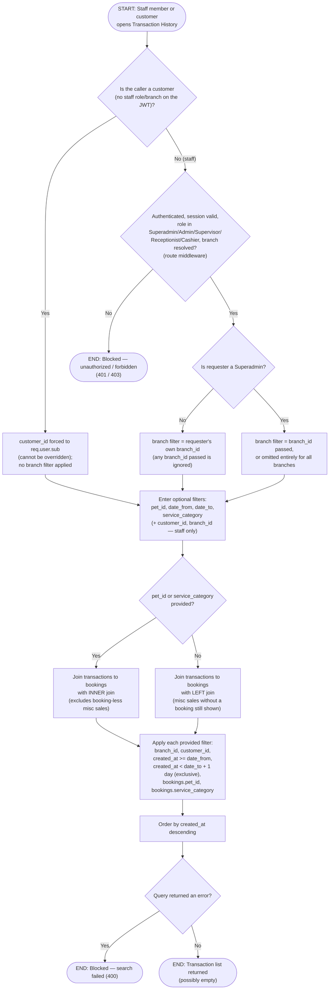

# M14 · Transaction History Search

**Actors:** Superadmin, Admin, Supervisor, Receptionist, Cashier, Customer (self-service)
**Code:** `server/src/features/reports/reports.controller.ts`,
`server/src/features/reports/reports.routes.ts`,
`server/src/features/reports/services/transactionHistory.service.ts`
**Part of:** [[M14-report-management|M14 · Report Management]]

Staff search a searchable, filterable transaction log at `GET
/reports/transaction-history`; a parallel customer-facing route (`GET
/reports/my-transaction-history`) reuses the same underlying query but is
always scoped server-side to the caller's own `customer_id`, with no
staff role or branch involved at all.

## Notes

- The customer-facing route (`/reports/my-transaction-history`) is a
  separate controller (`customerTransactionHistoryController`) but calls
  the exact same `listTransactionHistory()` service — the only structural
  difference is which fields get forced (`customerId` from the JWT,
  `branchId` never set) versus which come from query params.
- For staff, branch scoping mirrors the DSR/Cage-Occupancy pattern:
  non-Superadmin roles are pinned to their own branch no matter what
  `branch_id` they pass; a Superadmin can pass any branch or omit it to
  see every branch's transactions.
- The bookings join flips from `LEFT` to `INNER` **only** when `pet_id`
  or `service_category` is actually requested — filtering on a joined
  column requires the row to exist, so an unfiltered or
  customer/date-only search stays a `LEFT` join and still surfaces
  booking-less miscellaneous-sale transactions.
- `date_to` is inclusive of the whole calendar day: the service converts
  it to an **exclusive** upper bound one day later (`< date_to + 1 day`)
  rather than filtering on the literal timestamp, so a transaction
  recorded anywhere on `date_to` is still included.
- This endpoint has no backing SQL function — it's a plain, composable
  Supabase query, deliberately (per the source comment: "the filtering
  logic doesn't need to live in the database for this one").

## Relationship to other modules

Reads `transactions` and `bookings` from
[[M08-sales-billing|M08 · Sales & Billing]] and
[[M03-appointment-booking|M03 · Appointment Booking]].
