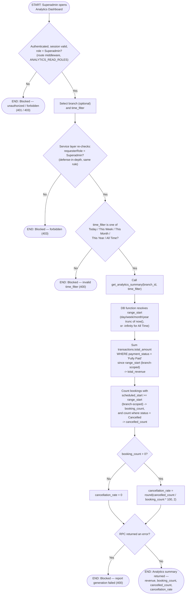

# M14 · Analytics Dashboard Summary

**Actors:** Superadmin
**Code:** `server/src/features/reports/reports.controller.ts`,
`server/src/features/reports/reports.routes.ts`,
`server/src/features/reports/services/analytics.service.ts`,
`supabase/migrations/20260805101_m14_create_reporting_functions.sql`,
`supabase/migrations/20260901157_m14_reporting_functions_settled_only.sql`
**Part of:** [[M14-report-management|M14 · Report Management]]

A Superadmin picks a branch (or leaves it blank for a combined view) and a
time window, and the Analytics Dashboard returns total revenue, booking
count, cancelled-booking count, and a computed cancellation rate for that
window — distinct from, and gated more tightly than, the operational
Daily Sales Report.

## Notes

- Superadmin-only is enforced **twice**: `ANALYTICS_READ_ROLES` at the
  route (`requireRole`) already restricts the route to `['Superadmin']`
  alone, and `analytics.service.ts` independently re-checks
  `requesterRole !== 'Superadmin'` and throws 403 — the second check is
  unreachable in practice through the HTTP route, but matches this
  codebase's established "RLS/route-plus-application-check" defense-in-
  depth convention rather than being dead code left by accident.
- `time_filter` is validated in the service layer against a fixed list
  (`today`, `this_week`, `this_month`, `this_year`, `all_time`); an
  invalid value is rejected before the RPC is ever called. The SQL
  function itself has a `case ... else date_trunc('day', now())` fallback
  that would silently treat an unrecognized value as `today`, but that
  branch is unreachable because the service already rejects it first.
- `booking_count` and `cancelled_count` are computed from
  `bookings.scheduled_start`, while `total_revenue` is computed from
  `transactions.created_at` — two different date columns feeding the
  same response, both filtered against the same `range_start`.
- **`total_revenue` counts only `payment_status = 'Fully Paid'`
  transactions** (migration `20260901157`). Since the payment/transactions
  rework a `booking_payment` row is created `Pending` up front, so an
  unqualified sum would count money not yet collected. `created_at` (not a
  settlement timestamp) is still the date the row is filtered by, so a
  charge created inside the window but settled later only enters
  `total_revenue` once it flips to `Fully Paid`.
- Cancellation-rate math treats a `booking_count` of zero as a `0` rate
  rather than dividing by zero.
- This is the only report in M14 restricted to Superadmin; the DSR and
  Cage Occupancy reports are also available to Admin/Supervisor
  (and Receptionist, for Cage Occupancy).

## Relationship to other modules

Reads `transactions` from [[M08-sales-billing|M08]] and `bookings`
(status, `scheduled_start`) from
[[M03-appointment-booking|M03 · Appointment Booking]].
