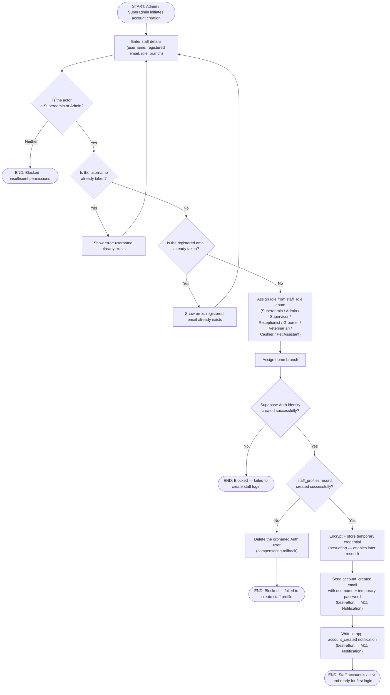

# M01 · Staff Account Creation

**Actors:** Admin, Superadmin
**Code:** `server/src/features/staff/services/staffManagement.service.ts`,
`server/src/features/staff/staff.controller.ts`
**Part of:** [[M01-staff-authentication-access-control|M01 · Staff Authentication & Access Control]]

An Admin or Superadmin enters a new staff member's details; the system
issues both a Supabase Auth identity and a `staff_profiles` row, then
delivers a temporary password by email and in-app notification.

## Notes

- Uniqueness is checked on **both** `username` and `registered_email` —
  either collision blocks creation before any Auth/profile write happens.
- If the `staff_profiles` insert fails after the Auth identity was already
  created, the service deletes that Auth user rather than leaving a
  login-capable account with no profile — a staff account has no identity
  separate from its profile row.
- The temp-credential encryption, the account_created email, and the
  in-app notification are all **best-effort**: a failure in any of them
  does not fail account creation, and the temporary password is still
  returned directly in the API response as a fallback the admin can relay
  by hand.
- Role/branch assignment at creation time is not restricted by the
  requester's own branch — Admin has the same branch-assignment reach as
  Superadmin here (only _changing_ an existing staff member's role/branch
  later is Superadmin-only — see the account-management side of this
  feature).

## Relationship to other modules

Delivery of the temporary-password email and its in-app mirror both go
through [[M11-notification|M11 · Notification]].
