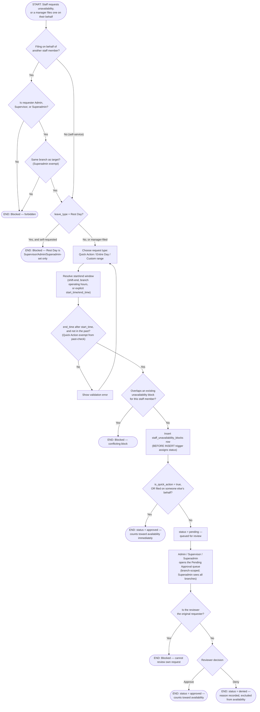

# M01 · Unavailability Block Request & Review

**Actors:** any staff member (self-service), Admin, Supervisor, Superadmin
**Code:** `server/src/features/staff/services/unavailabilityBlock.service.ts`,
`supabase/migrations/20260711019_m01_staff_unavailability_blocks_add_status.sql`
**Part of:** [[M01-staff-authentication-access-control|M01 · Staff Authentication & Access Control]]

A staff member can request their own time off, or an Admin/Supervisor/
Superadmin can file one on someone else's behalf. Whether the request needs
review depends on _how_ it was filed, not who filed it — a database trigger,
not application code, makes that call.

## Notes

- The approve/pend split is enforced by a **`BEFORE INSERT` trigger** on
  `staff_unavailability_blocks`, not by the service code that builds the
  insert — `is_quick_action = true` or `created_by <> staff_id` (on someone
  else's behalf) both auto-set `status = 'approved'`; every other case
  (self-service custom range, including a self-requested Entire Day)
  defaults to `'pending'`. Reading only `unavailabilityBlock.service.ts`
  would miss this — the insert payload itself never sets `status`.
  [[M09-policy-enforcement|M09]]-style business rules like this one that
  live in a DB trigger are easy to miss when reading service code alone.
- "Entire Day" is not a third approval path — it's just a different way of
  computing the start/end window (the target branch's full operating hours
  for that date). It still goes through the same pending-vs-approved rule
  as any other custom-range request.
- `requested_reviewer_id` (who the requester addressed the request to) is a
  **non-binding hint** — any Admin/Supervisor/Superadmin at the branch can
  still approve or deny it, not just the named reviewer.
- A reviewer can never approve/deny their own pending request — enforced
  both at the application layer and by an RLS policy, independently.
- This same table/approval machinery backs the Monthly Schedule calendar
  (Rest Day / Vacation Leave / Sick Leave), which is why Rest Day is
  excluded from self-service here: it's fixed and manager-set only.

## Relationship to other modules

`get_staff_availability()` (consumed by [[M03-appointment-booking|M03]]'s
Slot/Staff Picker) only excludes **approved** blocks — a pending or denied
request never affects booking availability.
