# M07 · Consultation Visit Flow (Check-in to Completion)

**Actors:** Veterinarian (write), Admin, Supervisor, Superadmin, Receptionist
(read-only)
**Code:** `server/src/features/veterinary/services/consultation.service.ts`,
`server/src/features/veterinary/veterinary.controller.ts`,
`server/src/features/veterinary/veterinary.routes.ts`,
`server/src/features/booking/services/booking.service.ts`
(`startBooking`/`completeBooking`),
`server/src/features/customers/pets/services/vaccinationRecord.service.ts`
**Part of:** [[M07-health-veterinary-management|M07 · Health & Veterinary Management]]

A Veterinary booking becomes a queue row the moment it's Pending or In
Progress; a Veterinarian works it from Start through vitals/diagnosis entry
to Complete, which finalizes billing line items and, if a vaccine was given,
writes straight through to the pet's vaccination record.

```mermaid
flowchart TD
    A(["START: Veterinarian opens\nthe Veterinary Console queue"]) --> B["Fetch Veterinary bookings\nfor the date range\n(status Pending/In Progress/Completed;\ndownpayment-unpaid rows excluded)"]
    B --> C{"Any Pending/In Progress\nbooking missing a\nconsultations row?"}
    C -- "Yes" --> D["Re-check Makati-branch eligibility\n(defense-in-depth)"] --> E["Auto-vivify a consultations row\n(reason_for_visit = special_instructions\nor 'General consultation')"]
    C -- "No" --> F["Render queue\n(Completed rows included, read-only)"]
    E --> F
    F --> G["Veterinarian selects a Pending row\nand clicks Start Consultation"]
    G --> H{"Requester role\n= Veterinarian?"}
    H -- "No" --> H1(["END: Blocked — forbidden (403)"])
    H -- "Yes" --> I{"Booking already\nCompleted?"}
    I -- "Yes" --> I1(["END: Blocked — consultation\nalready finalized (409)"])
    I -- "No" --> J{"Booking status\n= Pending?"}
    J -- "No" --> J1(["END: Blocked — cannot start\na non-Pending booking (409)"])
    J -- "Yes" --> K["startBooking:\nbookings.status -> In Progress,\nstarted_at set"]
    K --> L["Veterinarian records vitals,\ndiagnosis, medications, procedures\nwhile Ongoing (no status change required)"]
    L --> M["Veterinarian clicks Complete:\nenters professional_fee,\nmedication amounts, procedures,\noptional vaccination"]
    M --> N{"professional_fee present,\nand every medication\nhas an amount?"}
    N -- "No" --> N1["Show validation error"] --> M
    N -- "Yes" --> O{"Booking status\n= In Progress?"}
    O -- "No" --> O1(["END: Blocked — cannot complete\na non-In-Progress booking (409)"])
    O -- "Yes" --> P["completeBooking:\nbookings.status -> Completed,\ncompleted_at set"]
    P --> Q{"Already paid online\n(GCash/Maya, payment_confirmed,\nnot already Paid in Advance)?"}
    Q -- "Yes" --> Q1["Auto-advance payment_stage\n-> Paid"] --> R
    Q -- "No" --> R["Insert consultation_line_items:\nprofessional fee + one row per\nmedication/procedure"]
    R --> S{"Vaccination\nadministered?"}
    S -- "Yes" --> T["Write through to\npet_vaccination_records\n(reuses M02 vaccination service)"] --> U
    S -- "No" --> U["Update consultations row\n(vitals, diagnosis,\nmedications JSON)"]
    U --> V(["END: Consultation Completed —\nbilling line items recorded,\nvaccination synced if given"])
```

## Notes

- Auto-vivify has no DB trigger backing it (unlike grooming's own pattern) —
  `listConsultationQueue` creates the missing `consultations` row itself,
  in application code, the moment a Veterinary booking becomes visible to
  the queue. It never retroactively creates one for a booking that's
  already Completed; a Completed row only shows up because it picked up its
  `consultations` row earlier while still In Progress.
- `consultations.status`/`completed_at` were **dropped** by
  `20260728060_m07_drop_consultation_status.sql` — the booking-status
  revision moved the entire Pending → In Progress → Completed lifecycle
  onto the joined `bookings` row. `startBooking`/`completeBooking` (shared
  with every other service category) are what actually enforce the
  one-directional ordering and 409 on an invalid jump — reading only the
  consultation service without also checking `booking.service.ts` would
  miss this guard.
- Any Veterinarian may start/complete **any** consultation — there is no
  per-pet assigned-vet restriction (explicit product carve-out, also
  encoded directly in the RLS policies on `consultations`).
- The module note's "Pending/Ongoing/Completed columns" describes the same
  three states the client actually renders as **Pending / In Progress /
  Completed** (the booking's real status values) — the PATCH request body
  uses `status: 'Ongoing'` as the transition's action name, but no booking
  or consultation record ever stores the literal word "Ongoing".
- Line items are stored (`consultation_line_items`) but not yet posted to
  any real transaction — a `TODO(Sprint 5, M08)` in the code marks this as
  pending M08's existence; for now they're queryable but not yet part of
  M08 billing.
- The Dental Cleaning / Surgery / Emergency Consultation 50%-downpayment
  gate ([[M13-maintenance-packages-services-promos|M13]]) is enforced here
  too: a Pending/In Progress Veterinary booking with an unpaid required
  downpayment is excluded from the queue entirely, matching the module
  note's claim.

## Relationship to other modules

Booking-status transitions delegate to
[[M03-appointment-booking|M03]]'s shared `startBooking`/`completeBooking`.
Vaccination write-through reuses
[[M02-customer-portal-pet-management|M02]]'s vaccination record service.
Consultation line items are the future revenue feed into
[[M08-sales-billing|M08]].
