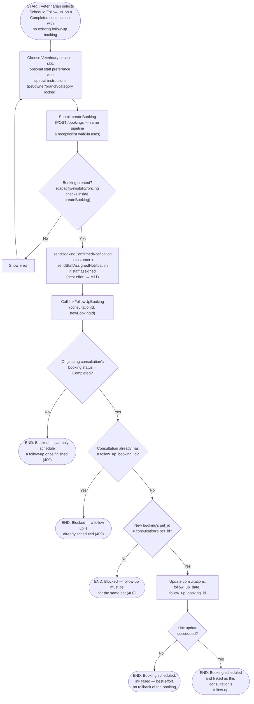

# M07 · Follow-Up Visit Scheduling

**Actors:** Veterinarian
**Code:** `client/src/features/veterinary/components/ScheduleFollowUpModal/ScheduleFollowUpModal.tsx`,
`server/src/features/veterinary/services/followUp.service.ts`,
`server/src/features/booking/services/booking.service.ts` (`createBooking`)
**Part of:** [[M07-health-veterinary-management|M07 · Health & Veterinary Management]]

From a finished consultation, a Veterinarian schedules a follow-up visit
through the normal booking pipeline, then the new booking is linked back
onto the originating consultation as a two-step action.

## Notes

- This is a **two-step** flow by design: the follow-up booking is created
  through the real booking-creation pipeline (`createBooking`), not a
  Veterinary-specific shortcut — it gets the same capacity/pricing/staff
  checks and fires the customer's `booking_confirmed` notification "for
  free," exactly as a receptionist walk-in would.
- `linkFollowUpBooking`'s three guard checks (finished, not already linked,
  same pet) are **defense-in-depth** — the UI already only offers "Schedule
  Follow-up" on a Completed row with no existing `follow_up_booking_id`,
  and the pet is locked in the modal before the booking is even created, so
  none of these should normally trigger from the UI path.
- If the link step fails after the booking was already created, the client
  does **not** roll back or delete the booking — the follow-up was still
  successfully scheduled from the customer's perspective, so the vet is
  routed straight to the new booking's receipt page rather than stranded
  with an orphaned retry.
- `consultations.follow_up_booking_id` is a **second** foreign key to
  `bookings` (alongside `booking_id`) — every query that embeds the joined
  booking must disambiguate with `!booking_id`, or PostgREST 400s on the
  ambiguous relationship.

## Relationship to other modules

The booking itself is created through
[[M03-appointment-booking|M03]]'s shared `createBooking` pipeline, which
fires the `booking_confirmed` and staff-assigned notifications via
[[M11-notification|M11]].
