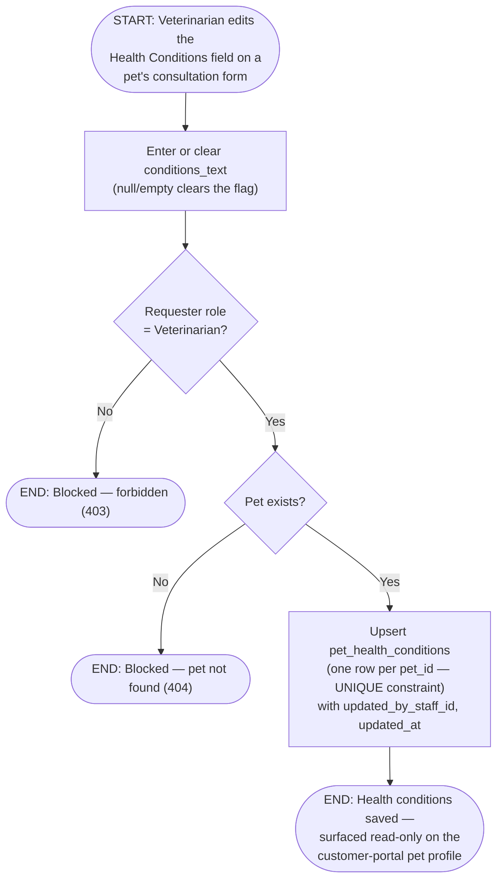

# M07 · Pet Health Conditions Recording

**Actors:** Veterinarian (write); any staff role, plus the owning customer
(read-only)
**Code:** `server/src/features/veterinary/services/petHealthConditions.service.ts`,
`server/src/features/veterinary/veterinary.controller.ts`,
`server/src/features/veterinary/veterinary.routes.ts`
**Part of:** [[M07-health-veterinary-management|M07 · Health & Veterinary Management]]

A Veterinarian records or updates a pet's current chronic conditions/
allergies from the consultation form. There's exactly one row per pet — a
current-state flag, not a per-visit history log — and it's the source for
the read-only badge on the customer-portal pet profile.

## Notes

- Any Veterinarian may record/update any Makati pet's health conditions —
  there is no per-pet assigned-vet restriction, the same carve-out
  `consultations.veterinarian_id` already has.
- `pet_health_conditions` is a **current-state** table (`pet_id UNIQUE`),
  not an append-only log — writing again overwrites the prior value rather
  than adding a new row. Per-visit clinical history still lives on
  individual `consultations` rows.
- Read access is asymmetric and lives on a **different endpoint**
  (`GET /pets/:petId/health-conditions` in the `customers/pets` feature,
  not this one): the owning customer can read their own pet's record
  directly, and any authenticated staff role can also read it — but only
  the `Veterinarian` role can write. A missing row returns `null`, not a
  404 — "no health conditions recorded" is a valid, common state.
- This table was migrated out of the general-purpose `pets.health_conditions`
  free-text column; that column is deliberately left in place (not dropped)
  until a separate, later migration removes it, so nothing reading the old
  column broke the moment this shipped.

## Relationship to other modules

Surfaced read-only on the pet profile in
[[M02-customer-portal-pet-management|M02]].
