# M03 · New Appointment Booking

**Actors:** Customer, Staff (any role, on behalf of a walk-in/phone-in customer)
**Code:** `server/src/features/booking/booking.controller.ts`,
`server/src/features/booking/services/booking.service.ts`,
`server/src/features/booking/services/{staffPicker,capacity,cagePicker,veterinaryEligibility,bookingNotifications}.service.ts`
**Part of:** [[M03-appointment-booking|M03 · Appointment & Booking]]

A customer (or staff, for a walk-in/phone-in) picks a branch, service
category, pet, one or more services/packages, and a date/time, then submits.
The server re-derives everything the client already showed read-only —
pricing, staff eligibility, capacity — as the single authoritative check
before the booking is created. There is no manual "staff confirms" step
anywhere in this flow.

**Payment is never collected here.** Since the payment/transactions rework
(migrations `20260901150`–`157`), `createBooking` collects **no payment
method and no card details** — only an optional `payment_scheme`
(`'full'` | `'downpayment'`), and that is only meaningful when the branch's
down-payment policy is switched on. Once the booking row exists, the server
emits exactly **one `Pending` `booking_payment` transaction** (via
`createInitialBookingCharge`) for the whole net total, or just the down
payment if the scheme is `'downpayment'`. A cashier settles that
transaction later on the Transactions page
([[M08-04-recording-a-counter-payment|M08-04]]). Veterinary bookings are
priced during the visit and get **no** upfront charge.

`netTotal = total_price − discount_amount − promo_amount` (discounts/promos
are resolved before the down payment, so the down payment is a share of the
discounted total).

The `booking_source` field splits the outcome:

- **`'Online'`** (the default, and the only value a customer can send) — a
  future or same-day appointment. Runs the per-transaction down-payment
  policy and is created `Pending`. If a down payment is required and unpaid
  it is a *pencil booking* that holds no slot (see Notes); otherwise it
  holds its slot immediately and a receptionist later hits **Check In**.
- **`'Walk-in'`** (receptionist-only — 403 from a customer caller) — the
  customer/pet is physically at the counter now. **Skips the down-payment
  policy entirely**, is created straight at `In Progress` with `started_at`
  set, and still gets its one `Pending` full-net-total `booking_payment`
  transaction for the cashier to settle.

```mermaid
flowchart TD
    A(["START: Customer (or staff) begins a booking"]) --> B["Select branch, category, pet, items;\nbrowse read-only Slot/Staff/Cage Picker"]
    B --> C["Submit booking payload\n(no payment method — optional payment_scheme only)"]
    C --> D{"Requester is staff\nor customer?"}
    D -- "Staff" --> E{"customer_id present\nin payload?"}
    E -- "No" --> F(["END: Blocked — customer_id required\nfor a staff-created booking"])
    E -- "Yes" --> WI{"booking_source = 'Walk-in'\nfrom a non-staff caller?\n(default is 'Online')"}
    D -- "Customer" --> G{"customer_id omitted,\nor equals requester's own id?"}
    G -- "No" --> F1(["END: Blocked — customers can\nonly create their own bookings"])
    G -- "Yes" --> WI
    WI -- "Yes" --> WF(["END: Blocked — only staff may\ncreate a walk-in booking"])
    WI -- "No" --> H["Look up pet by pet_id"]
    H --> I{"Pet exists and\nbelongs to the customer?"}
    I -- "No" --> J(["END: Blocked — pet not found\nor not this customer's"])
    I -- "Yes" --> M{"Veterinary AND branch\nis not a vet branch?"}
    M -- "Yes" --> N(["END: Blocked — Veterinary is\nMakati-branch only"])
    M -- "No" --> O["Resolve every item's price/duration\nsnapshot; sum total_price (see M03-02)"]
    O --> P{"Every item active,\ncategory-matched, pet assessed\nwhere required?"}
    P -- "No" --> Q(["END: Blocked — inactive item,\ncategory mismatch, or unassessed pet"])
    P -- "Yes" --> R["Resolve discount/promo lock-in;\nnetTotal = total_price − discount_amount − promo_amount"]
    R --> DP{"booking_source = 'Online'?"}
    DP -- "Yes (Online)" --> DP1["Resolve branch downpayment policy + notice\nlead time; snapshot downpayment_required /\ndownpayment_amount vs. netTotal (see M09)"]
    DP -- "No (Walk-in)" --> SCHEME
    DP1 --> SCHEME["Resolve paymentScheme:\n'downpayment' only if policy on AND\npayment_scheme = 'downpayment', else 'full'.\ninitialChargeAmount = down payment or netTotal.\nholdsSlot = NOT downpayment_required"]
    SCHEME --> T["Grooming/Veterinary: resolve staff\n(re-verify preference, or auto-assign)"]
    T --> U{"Staff required and\nnone eligible?"}
    U -- "Yes" --> V(["END: Blocked — no eligible staff\nfor the requested time"])
    U -- "No" --> W["Hotel: verify cage preference\n(advisory — degrades to null silently)"]
    W --> X{"holdsSlot AND Hotel/Daycare:\ncapacity available? (checkCapacity)"}
    X -- "Full" --> Y(["END: Blocked — no capacity\nfor the requested time"])
    X -- "Available / n·a / pencil" --> Z["Insert bookings row (payment_status='Pending')\n+ booking_items + staff_picker_preferences.\nOnline → Pending; Walk-in → In Progress, started_at=now"]
    Z --> AA{"holdsSlot: post-insert re-verification —\ndid this booking win the slot?"}
    AA -- "No" --> AB["Delete the losing booking row"] --> AC(["END: Blocked — capacity was taken\nbetween selection and submission"])
    AA -- "Yes / skipped (pencil)" --> AD{"Confirmed at creation?\n(Walk-in OR Veterinary)"}
    AD -- "Yes" --> AE["Send booking_confirmed (+ staff_assigned)"]
    AD -- "No (unpaid Online)" --> AF["Hold back confirmation notifications\n(fired later on first settled payment)"]
    AE --> CH
    AF --> CH{"requiresUpfrontCharge\n(category ≠ Veterinary)\nAND initialChargeAmount > 0?"}
    CH -- "Yes" --> CH1["createInitialBookingCharge:\none Pending booking_payment transaction\n+ matching line item (best-effort —\na failure is logged, booking is kept)"]
    CH -- "No (Veterinary / zero)" --> END
    CH1 --> END(["END: Booking created.\nOnline non-Vet: one Pending booking_payment\ntxn awaiting counter settlement; slot held\nunless a down payment is required & unpaid.\nWalk-in / Vet: confirmed at creation"])
```

## Notes

- **No payment at booking time.** `createBooking` writes `payment_status =
  'Pending'` and still sets the now-legacy `payment_method = null` /
  `payment_confirmed = false` columns, but **nothing reads them** any more —
  a booking's payment state is purely the rollup of its `transactions`
  rows. The only payment-shaped input is `payment_scheme`, and it only
  changes how big the initial charge transaction is.
- **The initial charge transaction** is emitted *after* the booking row,
  its items, the post-insert capacity re-check, and the confirmation
  notifications — and is **best-effort**: `createInitialBookingCharge`
  throwing is caught and logged, and never rolls back the booking (a
  cashier can add the charge manually via
  [[M08-04-recording-a-counter-payment|Add a payment]]). It inserts one
  `booking_payment` transaction (`payment_status = 'Pending'`,
  `payment_choice` = `'downpayment'` or `'full'`, `payment_method = 'Cash'`
  as a placeholder overwritten at settlement) plus one matching
  `transaction_line_items` row so `SUM(line_total) = total_amount`.
  Skipped entirely for Veterinary (`requiresUpfrontCharge = service_category
  !== 'Veterinary'`) and when `initialChargeAmount` is 0 (e.g. a fully
  discounted booking).
- **Down-payment slot gate.** When the down payment is enabled, an Online
  booking that hasn't paid any of it is a *pencil booking* — it exists at
  `Pending` but **reserves no slot** (`holdsSlot = !downpayment_required`).
  `createBooking` skips both the pre-insert and post-insert capacity checks
  for it; the capacity queries and `get_staff_availability()`'s Check 2
  exclude it via `SLOT_HOLD_PAID_OR_FILTER`, which since migration
  `20260901156` keys on **`payment_status != 'Pending'`** (was
  `payment_stage != 'Unpaid'`). Several customers can pencil-book the same
  slot; whoever's first `booking_payment` transaction settles reserves it —
  re-verified in `recomputeBookingPaymentStatus` /
  [[M08-04-recording-a-counter-payment|the counter-payment flow]], which
  409s if the slot filled in the meantime. The booking carries
  `downpayment_due_at` (`now + downpayment_hold_hours`, default 24h);
  `applyDownpaymentExpiry` — a lazy read-time sweep run before the No-show
  pass — cancels it if the deadline passes while `payment_status` is still
  `'Pending'`.
- **Confirmation notifications** (`booking_confirmed` to the customer,
  `staff_assigned` to a specifically-requested staff member) fire at
  creation only for a Walk-in or a Veterinary booking. For an unpaid Online
  booking they are held back and sent by `recomputeBookingPaymentStatus`
  when the first `booking_payment` transaction settles.
- The post-insert re-verification (`confirmCapacityAfterInsert`) exists
  because the Supabase client has no transactions: two simultaneous
  submissions for the last slot can both pass the pre-insert check, so the
  post-insert re-count deterministically picks the winner by
  `(created_at, id)` and deletes the loser's row. Skipped for a pencil
  booking (it reserves nothing).
- `get_staff_availability()` is a Postgres RPC — it independently re-checks
  branch operating hours, the fixed lunch break, overlapping slot-holding
  bookings, and approved-only
  [[M01-02-unavailability-block-request-review|unavailability blocks]].
  Migration `20260901156` re-pointed its Check 2 down-payment guard from
  `payment_stage = 'Unpaid'` to `payment_status = 'Pending'`.
- A Veterinary branch-eligibility failure is checked **before** any pricing
  or capacity work — a distinct, fail-fast 422.
- The Cage Picker preference is advisory only: an invalid or no-longer-
  available cage silently degrades to "no preference"; the real cage claim
  happens at Hotel check-in ([[M05-pet-hotel-boarding-management|M05]]).
- Cancellation and reschedule — including the notice-period/fee policy —
  are a separate workflow owned by [[M09-policy-enforcement|M09]].

## Relationship to other modules

Depends on [[M01-staff-authentication-access-control|M01]] (staff
availability, operating hours, lunch break),
[[M13-maintenance-packages-services-promos|M13]] (catalog pricing — see
[[M03-02-multi-item-booking-pricing|M03-02]]), and
[[M09-policy-enforcement|M09]] (the per-transaction downpayment policy and
notice lead time). Emits the first `booking_payment` transaction settled in
[[M08-04-recording-a-counter-payment|M08-04]] (or paid by the customer via
[[M08-02-customer-self-service-online-payment|M08-02]] /
[[M10-04-paying-a-transaction-with-credit|M10-04]]). Notifies via
[[M11-notification|M11]]. Feeds the Hotel check-in cage claim
([[M05-pet-hotel-boarding-management|M05]]) and the Daycare session flow
([[M06-daycare-management|M06]]).
