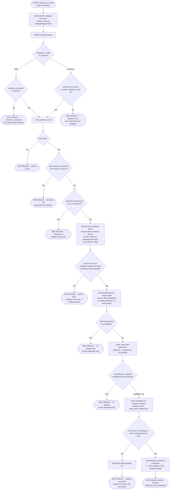

# M03 · New Appointment Booking

**Actors:** Customer, Staff (any role, on behalf of a walk-in/phone-in customer)
**Code:** `server/src/features/booking/booking.controller.ts`,
`server/src/features/booking/services/booking.service.ts`,
`server/src/features/booking/services/{availability,staffPicker,capacity,cagePicker,veterinaryEligibility,bookingNotifications}.service.ts`
**Part of:** [[M03-appointment-booking|M03 · Appointment & Booking]]

A customer (or staff, for a walk-in/phone-in) picks a branch, service
category, pet, one or more services/packages, and a date/time, then submits.
The server re-derives everything the client already showed read-only —
pricing, staff eligibility, capacity — as the single authoritative check
before the booking is created. There is no manual "staff confirms" step
anywhere in this flow: a successful submission is immediately `Pending` and
already holds its slot.

## Notes

- This runs the same capacity/staff-availability check the client already
  ran read-only ahead of submission (the Slot Picker's `getDaySlots`) — it
  is deliberately **never skipped as an optimization**, and a second,
  post-insert re-verification (`confirmCapacityAfterInsert`) exists because
  Supabase's client has no transactions: two simultaneous submissions for
  the last slot can both pass the pre-insert check, so the post-insert
  re-count deterministically picks the winner by `(created_at, id)` and
  deletes the loser's row.
- `get_staff_availability()` is a Postgres RPC, not application code — it
  independently re-checks branch operating hours, the fixed lunch break,
  overlapping active bookings, and approved-only
  [[M01-02-unavailability-block-request-review|unavailability blocks]]. Its
  history is a useful cautionary tale: two same-day migrations
  (`20260803083` retiring the `'Paid'` status value, and `20260804092`
  adding the lunch-break check) both redefined the function from the same
  earlier base without knowing about each other, silently reintroducing the
  retired `'Paid'` enum literal and breaking every availability read until
  `20260808109` fixed it.
- A Veterinary branch-eligibility failure is deliberately checked **before**
  any pricing or capacity work — it's a distinct, fail-fast 422, not a
  confusing capacity error.
- The Cage Picker preference is advisory only: an invalid or no-longer-
  available cage silently degrades to "no preference" rather than failing
  the whole booking — the real, concurrency-safe cage claim happens later,
  at Hotel check-in ([[M05-pet-hotel-boarding-management|M05]]).
- A staff-created booking passes no pet-size restriction on the cage
  preference; a customer's own booking can only honor a preference matching
  their own pet's `weight_class`.
- Cancellation and reschedule — including the notice-period/fee policy that
  governs them — are a separate workflow owned by
  [[M09-policy-enforcement|M09]], not diagrammed here.

## Relationship to other modules

Depends on [[M01-staff-authentication-access-control|M01]] (staff
availability, operating hours, lunch break),
[[M13-maintenance-packages-services-promos|M13]] (catalog pricing — see
[[M03-02-multi-item-booking-pricing|M03-02]]), and
[[M09-policy-enforcement|M09]] (the per-transaction downpayment policy).
Notifies via [[M11-notification|M11]]. Feeds the Hotel check-in cage claim
([[M05-pet-hotel-boarding-management|M05]]) and the Daycare session flow
([[M06-daycare-management|M06]]).
