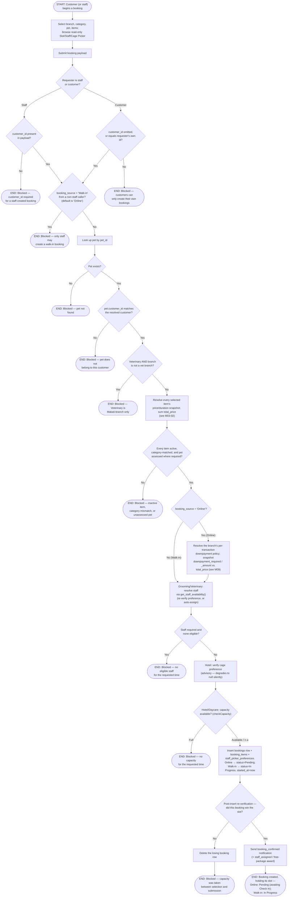

# M03 · New Appointment Booking

**Actors:** Customer, Staff (any role, on behalf of a walk-in/phone-in customer)
**Code:** `server/src/features/booking/booking.controller.ts`,
`server/src/features/booking/services/booking.service.ts`,
`server/src/features/booking/services/{availability,staffPicker,capacity,cagePicker,veterinaryEligibility,bookingNotifications}.service.ts`
**Part of:** [[M03-appointment-booking|M03 · Appointment & Booking]]

A customer (or staff, for a walk-in/phone-in) picks a branch, service
category, pet, one or more services/packages, and a date/time, then submits.
The server re-derives everything the client already showed read-only —
pricing, staff eligibility, capacity — as the single authoritative check
before the booking is created. There is no manual "staff confirms" step
anywhere in this flow.

The `booking_source` field (added in golden-fur #122) splits the outcome:

- **`'Online'`** (the default, and the only value a customer can send) — a
  future or same-day appointment. Runs the per-transaction down payment
  policy and is created `Pending`, holding its slot; a receptionist later
  hits **Check In** when the customer arrives, flipping it to `In Progress`.
- **`'Walk-in'`** (receptionist-only — rejected 403 from a customer caller)
  — the customer/pet is physically at the counter now. **Skips the down
  payment policy entirely** (`resolveDownpaymentPolicy` is never called,
  `downpayment_required` stays `false`) and is created straight at
  `In Progress` with `started_at` set. The capacity/staff/cage pipeline is
  otherwise identical — a walk-in still needs a real free slot right now, it
  just isn't picked from a future calendar.

`booking_source` is an explicit flag set by the receptionist's Online/Walk-in
toggle, **not** inferred from comparing the scheduled time to "now" — a
receptionist can still create an `'Online'` booking for later today, and it
is subject to the down payment policy like any other online booking.

## Notes

- **The per-transaction down payment policy applies to `'Online'` bookings
  only.** `createBooking` guards the whole block with
  `if (bookingSource === 'Online')` — a `'Walk-in'` never calls
  `resolveDownpaymentPolicy`, and `downpayment_required`/`downpayment_amount`
  are left `false`/`null` regardless of what an Admin configured on the
  Policies page. The client mirrors this (`CustomerBookingFlowPage` sets
  `downpaymentRequired = bookingSource !== 'Walk-in' && …` and hides the
  down-payment breakdown for a walk-in), but the server guard is the
  enforcement boundary. "Online" here means `booking_source = 'Online'` —
  set by the receptionist's Online/Walk-in toggle (or defaulted for a
  customer) — not a same-day-vs-future time comparison.
- **Down-payment slot gate** (advisor addendum A1–A4): when the down
  payment is enabled, an Online booking that hasn't paid any of it is a
  _pencil booking_ — it exists at `Pending` but **reserves no slot**. The
  capacity queries (`listOverlappingActiveBookings`,
  `confirmCapacityAfterInsert`) and `get_staff_availability()`'s Check 2
  all exclude `downpayment_required AND payment_stage = 'Unpaid'` rows, and
  `createBooking` skips the pre/post-insert capacity checks for it — so
  several customers can pencil-book the same slot and whoever pays first
  reserves it. Discounts/promos are applied _before_ the down payment is
  computed (it's a % of / capped at the discounted net total).
  `payment_confirmed` at creation is trusted only for a staff-created
  booking. The booking carries `downpayment_due_at` (`now +
downpayment_hold_hours`, default 24h); `applyDownpaymentExpiry` — a lazy
  read-time sweep run before the No-show pass — cancels it if the deadline
  passes unpaid. Paying (`advancePaymentStage`) re-checks capacity and
  `409`s if the slot filled in the meantime.
- A walk-in is born `In Progress` with `started_at` already set, so
  `applyNoShowTransition` (which only ever acts on `Pending`) can never flip
  it to No-show, and no separate Start/Check In step fires for it. An online
  booking stays `Pending` until a receptionist uses **Check In** on the
  Bookings Queue (`POST /bookings/:id/start`), at which point it appears in
  its category's execution queue alongside fresh walk-ins — the Grooming and
  Veterinary queues vivify only `status = 'In Progress'` rows now, not
  `Pending`.
- This runs the same capacity/staff-availability check the client already
  ran read-only ahead of submission (the Slot Picker's `getDaySlots`) — it
  is deliberately **never skipped as an optimization**, and a second,
  post-insert re-verification (`confirmCapacityAfterInsert`) exists because
  Supabase's client has no transactions: two simultaneous submissions for
  the last slot can both pass the pre-insert check, so the post-insert
  re-count deterministically picks the winner by `(created_at, id)` and
  deletes the loser's row.
- `get_staff_availability()` is a Postgres RPC, not application code — it
  independently re-checks branch operating hours, the fixed lunch break,
  overlapping active bookings, and approved-only
  [[M01-02-unavailability-block-request-review|unavailability blocks]]. Its
  history is a useful cautionary tale: two same-day migrations
  (`20260803083` retiring the `'Paid'` status value, and `20260804092`
  adding the lunch-break check) both redefined the function from the same
  earlier base without knowing about each other, silently reintroducing the
  retired `'Paid'` enum literal and breaking every availability read until
  `20260808109` fixed it.
- A Veterinary branch-eligibility failure is deliberately checked **before**
  any pricing or capacity work — it's a distinct, fail-fast 422, not a
  confusing capacity error.
- The Cage Picker preference is advisory only: an invalid or no-longer-
  available cage silently degrades to "no preference" rather than failing
  the whole booking — the real, concurrency-safe cage claim happens later,
  at Hotel check-in ([[M05-pet-hotel-boarding-management|M05]]).
- A staff-created booking passes no pet-size restriction on the cage
  preference; a customer's own booking can only honor a preference matching
  their own pet's `weight_class`.
- Cancellation and reschedule — including the notice-period/fee policy that
  governs them — are a separate workflow owned by
  [[M09-policy-enforcement|M09]], not diagrammed here.

## Relationship to other modules

Depends on [[M01-staff-authentication-access-control|M01]] (staff
availability, operating hours, lunch break),
[[M13-maintenance-packages-services-promos|M13]] (catalog pricing — see
[[M03-02-multi-item-booking-pricing|M03-02]]), and
[[M09-policy-enforcement|M09]] (the per-transaction downpayment policy).
Notifies via [[M11-notification|M11]]. Feeds the Hotel check-in cage claim
([[M05-pet-hotel-boarding-management|M05]]) and the Daycare session flow
([[M06-daycare-management|M06]]).
