# M03 · Multi-Item Booking Selection & Pricing

**Actors:** Customer, Staff
**Code:** `server/src/features/booking/services/booking.service.ts`,
`server/src/features/booking/booking.types.ts`,
`server/src/features/booking/modules/validators/booking.validator.ts`
**Part of:** [[M03-appointment-booking|M03 · Appointment & Booking]]

Within a single booking submission (see [[M03-01-new-appointment-booking|M03-01]]),
one or more services and/or packages have been checkbox-selected for one pet
in one service category. This workflow validates and prices each selected
item, snapshots those values onto `booking_items`, then rolls them up into
the booking's totals — including the downpayment-mix rule, an optional
Hotel free-package award, and an optional discount and/or promo.

```mermaid
flowchart TD
    A(["START: One or more services/packages\nselected for one pet, one category"]) --> B{"Per selected item:\npackage or standalone service?"}
    B -- "service" --> C["Verify service is active and its\ncategory matches the booking's category"]
    C --> D{"Service inactive or\ncategory mismatch?"}
    D -- "Yes" --> E(["END: Blocked — inactive service/package,\nwrong branch, or member-category mismatch (400)"])
    D -- "No" --> F{"service.requires_assessed_pet\nAND pet not yet assessed\n(weight_class/coat_type NULL)?"}
    F -- "Yes" --> G(["END: Blocked — pet must be assessed\nbefore this service/any package (403)"])
    F -- "No" --> H["Compute price: resolveServicePrice\n(matrix tier for a dog if use_pricing_matrix,\nelse base_price) x quantity\n(Hotel nights via resolveQuantity, else 1);\ncopy downpayment fields from catalog row"]
    H --> M["Add resolved item\n(price, duration, downpayment fields)\nto the booking's item list"]
    B -- "package" --> I{"Pet not yet assessed?\n(every package requires\nan assessed pet)"}
    I -- "Yes" --> G
    I -- "No" --> J["Verify package is active, available\nat this branch, and every member service\nbelongs to the booking's category"]
    J --> K{"Package inactive, wrong branch,\nor a member service outside\nthe booking's category?"}
    K -- "Yes" --> E
    K -- "No" --> L["Compute price: resolvePackagePrice\n(matrix cell of bundled_price if\nuse_pricing_matrix and pet is not a Cat,\nelse flat bundled_price) x quantity;\ncopy downpayment fields from catalog row"]
    L --> M
    M --> N{"More than one item overall\nAND any item requires\na downpayment?"}
    N -- "Yes" --> O(["END: Blocked — a downpayment-required\nitem must be booked on its own (400)"])
    N -- "No" --> P{"Hotel only: does the selected\nHotel service's min_nights_for_free_package\nthreshold get met by computed nights?"}
    P -- "Yes" --> Q["Append a zero-priced booking_items row\nfor the matching free package\n(resolved by name, filtered to one\navailable at this branch);\nnotify customer + branch Receptionists"]
    Q --> R
    P -- "No" --> R["total_price = sum of every item's\nprice_at_booking (pre-discount;\nfree-package award contributes 0)"]
    R --> S["catalogDownpaymentAmount = sum of each\nrequires_downpayment item's contribution\n(flat PHP, or % of that item's own price);\ndownpayment_required = amount > 0"]
    S --> T{"discount_id\nsupplied?"}
    T -- "Yes" --> U["Verify requester is a money-handling\nstaff role, payment_method = Cash,\ndiscount available at this branch,\nand its scope matches a selected item"]
    U --> V{"Any discount\ncheck failed?"}
    V -- "Yes" --> W(["END: Blocked — discount forbidden:\nwrong role, non-Cash payment,\nbranch-unavailable, or scope\nmismatch (400/403)"])
    V -- "No" --> X["discount_amount = discount.value%\nof total_price, or flat value\ncapped at total_price"]
    X --> Y
    T -- "No" --> Y{"promo_id\nsupplied?"}
    Y -- "Yes" --> Z["Verify promo is active, within its\nstart/end date window, available at\nthis branch, and its scope\n(all_services, or a specific\nservice/package) matches a selected item"]
    Z --> AA{"Any promo\ncheck failed?"}
    AA -- "Yes" --> AB(["END: Blocked — promo inactive,\nnot started, ended, branch-unavailable,\nor scope mismatch (400)"])
    AA -- "No" --> AC["promo_amount = min(promo.value%\nor flat value of total_price,\nthe branch's or default\npromo_cap_configuration cap)"]
    AC --> AD(["END: booking_items inserted with\nprice/duration snapshots; total_price/\ndiscount_amount/promo_amount/\ndownpayment_required/amount stored\non the booking row"])
    Y -- "No" --> AD
```

## Notes

- A package always requires an assessed pet, even if none of its member
  services individually set `requires_assessed_pet` — the check is on the
  package itself, not delegated to its members.
- The downpayment-mix rule (only one item allowed on a booking that includes
  a downpayment-required item) is checked **after** every item has already
  been priced and collected, not per-item as each is validated — it looks at
  the whole selected set at once.
- The Hotel free-package award is evaluated per Hotel service against that
  service's own `min_nights_for_free_package`, not a branch- or system-wide
  threshold; the awarded package is looked up by name and filtered to one
  available at the booking's branch, so a differently-named or
  branch-unavailable "free package" silently does not award.
- `total_price` is always the **pre-discount** sum of `price_at_booking`
  across items (the free-package award contributes 0) — `discount_amount`
  and `promo_amount` are stored separately rather than baked into
  `total_price`, matching the module note's "lock-in" description.
- Discounts are cash-only and role-gated (money-handling staff roles only);
  promos have no such restriction but are date-windowed and capped by a
  `promo_cap_configuration` (branch-specific if one exists, else a system
  default).
- Discount and promo are independent, sequential checks — a booking can
  carry both at once, each validated and applied against `total_price`
  separately.

## Relationship to other modules

Reads catalog data (services, packages, discounts, promos, downpayment
flags) owned by [[M13-maintenance-packages-services-promos|M13]]. Feeds into
[[M03-01-new-appointment-booking|M03-01]] as the pricing/validation step run
during booking submission.
