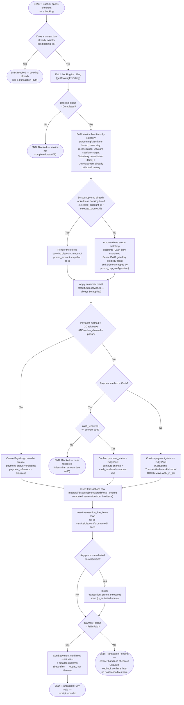

# M08 · Cashier Checkout

**Actors:** Cashier, Receptionist, Supervisor, Admin, Superadmin
**Code:** `server/src/features/billing/services/checkoutAggregation.service.ts`,
`server/src/features/billing/services/lineItemSources.service.ts`,
`server/src/features/billing/services/discountPromoEvaluation.service.ts`,
`server/src/features/billing/services/paymentMethod.service.ts`,
`server/src/features/billing/services/creditStub.service.ts`,
`server/src/features/billing/services/paymongo.service.ts`
**Part of:** [[M08-sales-billing|M08 · Sales & Billing]]

A money-handling staff member checks out a booking whose underlying service
has already completed: the system assembles service/discount/promo line
items, applies any credit (currently a stub), resolves the payment method,
and persists one `transactions` row plus its `transaction_line_items` —
`total_amount` is always the server-computed `SUM(line_total)`, never a
client-supplied figure.

## Notes

- `booking.payment_method` (locked in at booking creation) — not the
  checkout-time payment method chosen here — gates whether
  `evaluateDiscounts` runs at all: it returns nothing unless that stored
  value is `'Cash'`, mirroring the same Cash-only-for-discounts rule
  `resolveDiscountAndPromo` enforces at booking time (`discountPromoEvaluation.service.ts`).
  Promos have no such payment-method gate.
- Promo combinability is capped by `promo_cap_configuration` (branch row, or
  the system-wide default): a `percentage`/`flat` cap applies promos
  largest-value-first and trims the last one that would cross the cap; a
  `count` cap instead applies the largest-value N promos in full and drops
  the rest — no partial trimming for a count cap, since a "count" has no
  fractional promo.
- **Credit application is a stub as shipped** — `creditStub.service.ts`
  always returns `appliedAmount: 0` regardless of what the cashier
  requested; `credit_applied_amount` is written to the transaction but
  never actually reduces `total_amount` yet (see [[M10-credit-balance-management|M10]]).
- A Hotel booking nets out its downpayment from the `stays` record
  (`getHotelLineItems`), not the generic `downpaymentNettingLines` helper
  every other category uses — both produce an equivalent negative
  `discount`-typed line, just sourced differently.
- `payment_confirmed` only fires here, at checkout time, when the resulting
  transaction is immediately `Fully Paid`. A checkout that goes `Pending`
  (GCash/Maya portal channel) does **not** get this notification re-fired
  when [[M08-02-customer-self-service-online-payment|the webhook later confirms it]] —
  flagged in the code as a known gap, not yet reflected in the module note's
  Open Items.
- `processed_by_staff_id` is only set when the transaction resolves
  `Fully Paid` immediately — a `Pending` PayMongo-portal transaction is left
  unattributed to a staff member at creation time.

## Relationship to other modules

Reads discounts/promos from [[M12-discount-management|M12]]/[[M13-maintenance-packages-services-promos|M13]] and
credit balances (stub) from [[M10-credit-balance-management|M10]]. Sends the
`payment_confirmed` notification via [[M11-notification|M11]]. Feeds
[[M14-report-management|M14]] reporting. Booking data originates in
[[M03-appointment-booking|M03]] and its category-specific modules
(M04–M07).
