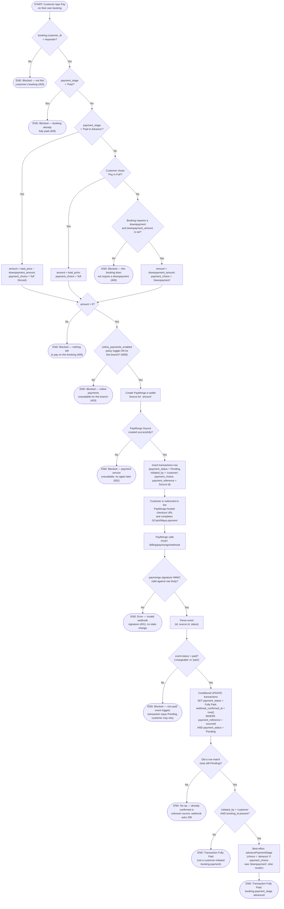

# M08 · Customer Self-Service Online Payment

**Actors:** Customer, (PayMongo webhook — unauthenticated system caller)
**Code:** `server/src/features/billing/services/customerBookingPayment.service.ts`,
`server/src/features/billing/services/webhookConfirmation.service.ts`,
`server/src/features/billing/services/paymongo.service.ts`,
`server/src/features/billing/routes/paymongoWebhook.routes.ts`
**Part of:** [[M08-sales-billing|M08 · Sales & Billing]]

A customer pays for their own booking from the portal (My Bookings > Pay) —
full price or just the required downpayment — via GCash/Maya. This is a
real PayMongo redirect checkout, distinct from a cashier's
[[M08-01-cashier-checkout|counter checkout]]: it always creates a `Pending`
`transactions` row tagged `initiated_by = 'customer'`, and only the PayMongo
webhook — not any cashier action — later confirms it and advances the
booking's `payment_stage`.

## Notes

- The three "amount" branches (advance-forced full balance, Pay in Full,
  downpayment-only) are mutually exclusive and evaluated in that order —
  `payment_stage = 'Paid in Advance'` overrides whatever `pay_in_full` the
  client sent, since the only thing left to collect is the remaining
  balance.
- `initiated_by`/`payment_choice` default to `'staff'`/`null` for every
  other transaction (including a cashier checkout that also happens to use
  the GCash/Maya `'portal'` channel — see
  [[M08-01-cashier-checkout|Cashier Checkout]]). The webhook confirms
  **any** `Pending` row by `payment_reference` regardless of who initiated
  it, but only advances `payment_stage` when `initiated_by = 'customer'`
  and a `booking_id` is present — a misc-sale's `Pending` row (no
  `booking_id`) or a staff-initiated portal transaction is confirmed the
  same way but never touches `payment_stage`.
- The webhook always responds `200` once the signature is valid, even for a
  `'failed'` event or a no-op re-delivery — a non-2xx here would make
  PayMongo retry redelivery indefinitely for an event this service already
  finished handling.
- The conditional `UPDATE ... WHERE payment_status = 'Pending'` is the sole
  idempotency guard — a second webhook delivery for an already-confirmed
  transaction matches no row and is a safe no-op, with no separate
  event-id dedup table.
- `advancePaymentStage` failures are logged, not rethrown — the webhook
  must still ack `200` for PayMongo even if the booking-side update fails;
  the transaction itself is already `Fully Paid` by that point regardless.

## Relationship to other modules

Reads the `online_payments_enabled` toggle from
[[M09-policy-enforcement|M09]] (per-branch or system-wide). Advances
`bookings.payment_stage` via [[M03-appointment-booking|M03]]'s
`advancePaymentStage`. Shares its webhook confirmation mechanism with any
other `Pending` PayMongo transaction, including a cashier's
[[M08-01-cashier-checkout|counter checkout]] and a
[[M08-03-miscellaneous-sale-entry|miscellaneous sale]].
