# M08 · Customer Self-Service Online Payment

**Actors:** Customer, (PayMongo webhook — unauthenticated system caller)
**Code:** `server/src/features/billing/services/customerBookingPayment.service.ts`,
`server/src/features/billing/services/webhookConfirmation.service.ts`,
`server/src/features/billing/services/paymongo.service.ts`,
`server/src/features/billing/routes/paymongoWebhook.routes.ts`,
`server/src/features/booking/services/booking.service.ts` (`recomputeBookingPaymentStatus`)
**Part of:** [[M08-sales-billing|M08 · Sales & Billing]]

A customer pays for their own booking from the portal (My Bookings > Pay) —
full price or just the required down payment — via GCash/Maya. This is a
real PayMongo redirect checkout: it always creates a `Pending` `transactions`
row tagged `initiated_by = 'customer'`, and only the PayMongo webhook — not
any cashier action — later confirms it.

Since the payment/transactions rework, the webhook's booking-side effect
goes through **`recomputeBookingPaymentStatus`** (the deleted
`advancePaymentStage` is gone). That function re-derives
`bookings.payment_status` from the booking's settled `booking_payment`
transactions, and — for a still-`Pending` down-payment booking whose first
payment this is — **re-checks the slot-gate capacity** and fires the
**confirmation notifications** that [[M03-01-new-appointment-booking|booking
creation]] held back.

```mermaid
flowchart TD
    A(["START: Customer taps Pay\non their own booking"]) --> B{"booking.customer_id\n= requester?"}
    B -- "No" --> C(["END: Blocked — not this\ncustomer's booking (403)"])
    B -- "Yes" --> D{"payment_status\n= 'Fully Paid'?"}
    D -- "Yes" --> E(["END: Blocked — booking already\nfully paid (409)"])
    D -- "No" --> F{"payment_status\n= 'Partially Paid'?"}
    F -- "Yes" --> G["amount = total_price − downpayment_amount;\npayment_choice = 'full' (forced)"]
    F -- "No" --> H{"Customer chose\n'Pay in Full'?"}
    H -- "Yes" --> I["amount = total_price;\npayment_choice = 'full'"]
    H -- "No" --> J{"Booking requires a down payment\nand downpayment_amount is set?"}
    J -- "No" --> K(["END: Blocked — this booking does\nnot require a down payment (400)"])
    J -- "Yes" --> L["amount = downpayment_amount;\npayment_choice = 'downpayment'"]
    G --> M{"amount > 0?"}
    I --> M
    L --> M
    M -- "No" --> N(["END: Blocked — nothing left\nto pay on this booking (409)"])
    M -- "Yes" --> O{"online_payments_enabled\npolicy toggle ON for\nthis branch? (M09)"}
    O -- "No" --> P(["END: Blocked — online payments\nunavailable for this branch (403)"])
    O -- "Yes" --> Q["Create PayMongo e-wallet Source for `amount`"]
    Q --> R{"PayMongo Source\ncreated successfully?"}
    R -- "No" --> S(["END: Blocked — payment service\nunavailable, try again later (502)"])
    R -- "Yes" --> T["Insert transactions row\n(payment_status = Pending, initiated_by = 'customer',\npayment_choice, payment_reference = Source id)"]
    T --> U["Customer redirected to the PayMongo-hosted\ncheckout URL; completes GCash/Maya payment"]
    U --> V["PayMongo calls POST /billing/paymongo/webhook"]
    V --> W{"paymongo-signature HMAC\nvalid against raw body?"}
    W -- "No" --> X(["END: Error — invalid webhook\nsignature (401), no state change"])
    W -- "Yes" --> Y{"event.status = paid?"}
    Y -- "No" --> AA(["END: Non-paid event logged;\ntransaction stays Pending,\ncustomer may retry; webhook acks 200"])
    Y -- "Yes" --> AB["Conditional UPDATE: transactions\nSET payment_status = Fully Paid, webhook_confirmed_at = now()\nWHERE payment_reference = sourceId AND payment_status = 'Pending'"]
    AB --> AC{"Did a row match\n(was still Pending)?"}
    AC -- "No" --> AD(["END: No-op — already confirmed or\nunknown source; webhook acks 200"])
    AC -- "Yes" --> AE{"initiated_by = 'customer'\nAND booking_id present?"}
    AE -- "No" --> AF(["END: Transaction Fully Paid\n(not a customer-initiated booking payment)"])
    AE -- "Yes" --> AG["Best-effort recomputeBookingPaymentStatus(booking_id)"]
    AG --> AH["Recompute payment_status from settled\nbooking_payment transactions; set paid_at\nwhen it reaches Fully Paid"]
    AH --> AI{"Was Pending + downpayment_required\n+ status Pending/In Progress:\nconfirmCapacityAfterInsert still wins?"}
    AI -- "No (slot filled)" --> AJ["Revert payment_status → Pending;\nthrow 409 (caught + logged by the webhook —\nstill acks 200)"]
    AI -- "Yes / n·a" --> AK{"Was Pending + status Pending + Online?"}
    AK -- "Yes" --> AL["Send the held-back booking_confirmed\n(+ staff_assigned for a specific pick)"]
    AK -- "No" --> AM
    AL --> AM(["END: Transaction Fully Paid;\nbooking.payment_status rolled up"])
    AJ --> AN(["END: Transaction Fully Paid but booking\nreverted to Pending — slot filled while unpaid\n(edge case, see Notes)"])
```

## Notes

- **`payment_status` replaced `payment_stage`** everywhere in this flow
  (migration `20260901150`). The three branches map straight across:
  `'Paid'` → `'Fully Paid'`, `'Paid in Advance'` → `'Partially Paid'`,
  `'Unpaid'` → `'Pending'`. The `'Partially Paid'` branch still bills the
  *remaining balance* (`total_price − downpayment_amount`) regardless of
  what `pay_in_full` the client sent.
- **Amount math uses `total_price`, not the discounted net total.**
  `payForBooking` computes `amount` from `booking.total_price` /
  `downpayment_amount` directly — it does **not** subtract
  `discount_amount` / `promo_amount` the way `settle_transaction`'s rollup
  and `createInitialBookingCharge` do. For a booking with a booking-time
  discount/promo, a customer "Pay in Full" here can therefore over-collect
  versus the net total. Pre-existing behaviour, not introduced by the
  rework — flagged for the team.
- **`recomputeBookingPaymentStatus` does three things** in order: (1)
  re-derive `payment_status` from the sum of the booking's non-`Pending`
  `booking_payment` transactions and write it (plus `paid_at` on `Fully
  Paid`); (2) if this was the first payment on a still-`Pending`
  down-payment booking, run `confirmCapacityAfterInsert` — and if the slot
  filled while the booking sat unpaid, **revert `payment_status` to
  `Pending` and throw 409**; (3) otherwise, for a still-`Pending` Online
  booking, send the `booking_confirmed` / `staff_assigned` notifications
  that `createBooking` deferred.
- **Edge case, flagged:** the 409 from step (2) is caught and logged by the
  webhook handler (which must still ack 200 so PayMongo stops retrying).
  Net result: the customer's money is captured, the `transactions` row is
  `Fully Paid`, but `bookings.payment_status` is back to `Pending` and the
  booking still holds no slot. There is no automatic refund or
  re-notification path for this today.
- The webhook confirms **any** `Pending` row by `payment_reference`
  regardless of `initiated_by`, but only calls
  `recomputeBookingPaymentStatus` when `initiated_by = 'customer'` and a
  `booking_id` is present — a cashier's own portal-channel checkout
  (`initiated_by = 'staff'`) or a misc-sale's `Pending` row is confirmed
  the same way but never touches the booking.
- The conditional `UPDATE ... WHERE payment_status = 'Pending'` is the sole
  idempotency guard — a re-delivered webhook for an already-confirmed
  transaction matches no row and is a safe no-op.

## Relationship to other modules

Reads the `online_payments_enabled` toggle from
[[M09-policy-enforcement|M09]]. Rolls up `bookings.payment_status` via
[[M03-appointment-booking|M03]]'s `recomputeBookingPaymentStatus` — the
app-side counterpart of the `settle_transaction` RPC used by the
[[M08-04-recording-a-counter-payment|counter-payment]] and
[[M10-04-paying-a-transaction-with-credit|pay-with-credit]] paths. Shares its
webhook confirmation mechanism with any other `Pending` PayMongo
transaction.
