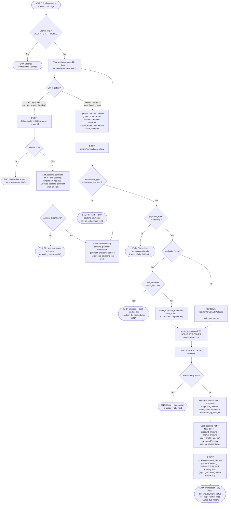

# M08 · Recording a Counter Payment

**Actors:** Cashier, Receptionist, Supervisor, Admin, Superadmin (`BILLING_STAFF_ROLES`)
**Code:** `server/src/features/billing/services/transactionPayment.service.ts`,
`server/src/features/billing/services/paymentMethod.service.ts`,
`server/src/features/billing/billing.controller.ts`,
`server/src/features/billing/modules/validators/billing.validator.ts`,
`client/src/features/billing/pages/TransactionsPage/TransactionsPage.tsx`,
`supabase/migrations/20260901153_m08_settle_transaction_rpc.sql`,
`supabase/migrations/20260901154_m08_add_booking_payment_rpc.sql`
**Part of:** [[M08-sales-billing|M08 · Sales & Billing]]

The payment/transactions rework replaced the old Payments Queue (which
marked *whole bookings* paid in one step) with the **Transactions page**
(`/staff/billing/transactions`), where a money-handling staff member settles
*individual* `booking_payment` transactions. A booking can carry several —
the initial charge from [[M03-01-new-appointment-booking|booking creation]]
plus one or more balance payments — and each is settled with its own method.
Settling a transaction atomically flips it to `Fully Paid` **and** recomputes
the parent booking's `payment_status` rollup (`Pending` → `Partially Paid` →
`Fully Paid`).

Two actions live on this page:

- **Record payment** — settle an existing `Pending` `booking_payment`
  transaction (`POST /billing/transactions/:id/pay`).
- **Add a payment** — add a new balance charge against a booking, which then
  appears as a fresh `Pending` transaction to be settled the same way
  (`POST /billing/bookings/:id/payments`).

## Notes

- **Role gate.** The routes use `requireRole([...BILLING_STAFF_ROLES])` —
  Superadmin, Admin, Supervisor, Receptionist, Cashier. The client
  `TransactionsPage` mirrors the same set and redirects anyone else to
  `/staff/settings`. Groomer / Veterinarian / Pet Assistant advance the
  service lifecycle but never touch payment.
- **Methods.** `recordTransactionPayment` accepts `COUNTER_PAYMENT_METHODS`
  only: `Cash`, `Card`, `Bank Transfer`, `Grabmart`, `Pickaroo`. GCash/Maya
  are deliberately excluded — the portal channel is confirmed by the
  PayMongo webhook ([[M08-02-customer-self-service-online-payment|M08-02]]),
  the walk-in-QR channel is settled through
  [[M08-01-cashier-checkout|checkout]]. `Credit` is settled through the
  separate [[M10-04-paying-a-transaction-with-credit|pay-with-credit]] path.
- **`settle_transaction` is the atomic write.** It locks the transaction and
  the booking `FOR UPDATE`, so the transaction flip and the booking rollup
  can't diverge under concurrency. It raises if the transaction is already
  `Fully Paid` (surfaced as a 400) or has no `booking_id`. `p_cash_tendered`
  is passed for call-site symmetry but **not persisted** — `transactions`
  has no tendered/change column, so the change amount is only returned in
  the HTTP response for the cashier to read off.
- **The rollup rule is shared** by `settle_transaction`,
  `add_booking_payment`, and the app-side `recomputeBookingPaymentStatus`:
  `net = total_price − discount_amount − promo_amount`; `paid = Σ
  total_amount` over the booking's **non-`Pending`** `booking_payment`
  transactions. All three produce the same three-value `payment_status`.
- **"Add a payment"** (`add_booking_payment`) creates the new row with
  `payment_choice = 'balance'` and a `'Cash'` placeholder method
  (overwritten at settlement) plus its `'Additional payment'` line item, in
  one transaction. The client only shows the "Add a payment" affordance on a
  booking group where **no** row is currently `Pending`.
- **First-payment side-effects.** `settle_transaction` does only the SQL
  `payment_status` rollup, so after it returns the service calls
  `applyFirstBookingPaymentSideEffects` (shared with the webhook path). When
  the *first* payment on a down-payment pencil booking lands at the counter,
  that re-verifies the down-payment slot gate and fires the held-back
  `booking_confirmed` / `staff_assigned` notifications. The one difference
  from the webhook path: a capacity conflict here does **not** roll the
  payment back (the cash is already in the drawer) — the booking is left
  overbooked for staff to reschedule, and the confirmation alert still goes
  out. The webhook path hard-rejects with a 409 instead, since nothing is
  settled yet.

## Relationship to other modules

Settles the `booking_payment` transactions emitted by
[[M03-01-new-appointment-booking|M03-01]]. Shares its rollup logic with the
customer webhook path ([[M08-02-customer-self-service-online-payment|M08-02]])
and the credit path ([[M10-04-paying-a-transaction-with-credit|M10-04]]).
`bookings.payment_status` feeds the slot-hold gate
([[M03-appointment-booking|M03]]), the operational queues (M04–M07), and the
`Fully Paid`-only reporting aggregations
([[M14-01-daily-sales-report-generation|M14-01]] /
[[M14-04-analytics-dashboard-summary|M14-04]]).
