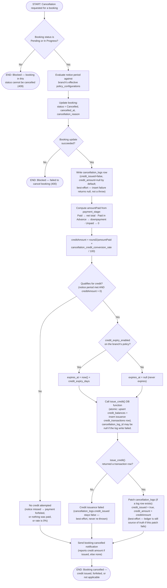

# M10 · Cancellation-to-Credit Conversion

**Actors:** Customer, any staff member (whoever is cancelling), Admin/Superadmin (policy configuration)
**Code:** `server/src/features/booking/services/cancellation.service.ts`,
`server/src/features/booking/services/cancellationLog.service.ts`,
`server/src/features/credits/services/creditIssuance.service.ts`
**Part of:** [[M10-credit-balance-management|M10 · Credit Balance Management]]

A customer or staff member cancels a booking. Cancellation itself is never
blocked by an unmet notice period — what the notice outcome decides is
whether the money the customer already paid is converted into branch-locked
credit or simply forfeited. When it is converted, only a configurable
percentage of the paid amount becomes credit
(`cancellation_credit_conversion_rate`, default 100% — the advisor asked for
this to be adjustable, e.g. down to 50%, so a late-ish cancellation can keep
part of the payment as a charge).

## Notes

- Cancellation and credit issuance are **not** one atomic unit: the booking
  status update, the `cancellation_logs` insert, and the `issue_credit()`
  call are three separate steps. Only the balance-increment + issuance-row
  pair inside `issue_credit()` itself is atomic (a single PL/pgSQL function,
  `SECURITY DEFINER`, called via RPC) — see
  `supabase/migrations/20260805097_m10_create_credit_transactions_schema.sql`.
- **What gets converted is the amount actually paid, not the configured
  downpayment.** `amountPaid` is derived from `bookings.payment_stage`:
  `Paid` → the discounted net total (`total_price − discount_amount −
promo_amount`); `Paid in Advance` → `downpayment_amount`; `Unpaid` (or
  unset) → `0`. So a booking paid in full returns its whole net total, a
  booking that only paid the downpayment returns the downpayment, and an
  unpaid booking (e.g. a still-Pending down-payment reservation cancelled
  before its hold expires) returns nothing — no credit for money the
  business never received.
- **The conversion rate** is `policy_configurations.cancellation_credit_conversion_rate`
  — a percentage `0`–`100`, `NOT NULL DEFAULT 100`, branch-scoped and
  resolved by the same `resolveEffectivePolicy()` used for the notice
  period, reschedule fee, and credit expiry. Editable on Settings → Config →
  Policies (Admin/Superadmin). `creditAmount = round2(amountPaid × rate /
100)`; a rate of `0` means a qualifying cancellation converts nothing.
  Migration `supabase/migrations/20260901149_m10_policy_cancellation_credit_conversion_rate.sql`.
- A Strict-mode unmet notice period never blocks cancellation the way it
  blocks a _reschedule_ — it only withholds credit. This mirrors the
  distinction already documented for reschedule's own notice check.
- Any booking that was actually paid can now qualify — including a
  fully-paid Grooming/Daycare/Veterinary booking, which previously could
  never get credit because the old logic keyed off `downpayment_amount`
  alone. The notice period still has to be met.
- **A failed `cancellation_logs` insert no longer skips credit issuance**
  (previously the guard was `qualifies && log`; issue #117).
  `credit_transactions.cancellation_log_id` is nullable, so the credit is
  issued with a null link and only the log-row summary is lost. A failed
  `issue_credit()` RPC still just leaves `credit_issued = false`; a failed
  patch of the log row after a successful issuance leaves the ledger correct
  but the log's summary fields stale. None of these raise an error back to
  the caller — the booking is already cancelled by the time any of them can
  happen.
- `credit_expiry_enabled` / `credit_expiry_days` come from `policy_configurations`
  (default `true` / `30`, see
  `supabase/migrations/20260805094_m09_policy_configurations_downpayment_reschedule_fee_credit_expiry.sql`).

## Relationship to other modules

Triggered from [[M09-policy-enforcement|M09]]'s cancellation flow
(`evaluateNoticePeriod()`), which reads the same `policy_configurations`
table this workflow reads for the conversion-rate/credit-expiry rules. The
paid amount it converts comes from `bookings.payment_stage`, driven by
[[M08-billing-payments|M08]]'s payment flow. Feeds
[[M14-report-management|M14]]'s DSR once redemption is wired up (currently
issuance-only, per [[M10-credit-balance-management|M10]]'s Status section).
The navbar credit indicator (customer portal) reads the resulting
`credit_balances` and refreshes right after this flow issues credit.
