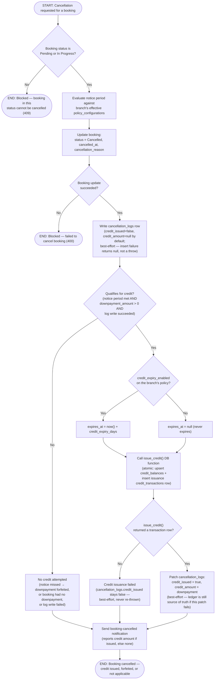

# M10 · Cancellation-to-Credit Conversion

**Actors:** Customer, any staff member (whoever is cancelling), Admin/Superadmin (policy configuration)
**Code:** `server/src/features/booking/services/cancellation.service.ts`,
`server/src/features/booking/services/cancellationLog.service.ts`,
`server/src/features/credits/services/creditIssuance.service.ts`
**Part of:** [[M10-credit-balance-management|M10 · Credit Balance Management]]

A customer or staff member cancels a booking. Cancellation itself is never
blocked by an unmet notice period — what the notice outcome (and whether the
booking actually carried a non-refundable downpayment) decides is whether
that downpayment is converted into branch-locked credit or simply forfeited.

## Notes

- Cancellation and credit issuance are **not** one atomic unit: the booking
  status update, the `cancellation_logs` insert, and the `issue_credit()`
  call are three separate steps. Only the balance-increment + issuance-row
  pair inside `issue_credit()` itself is atomic (a single PL/pgSQL function,
  `SECURITY DEFINER`, called via RPC) — see
  `supabase/migrations/20260805097_m10_create_credit_transactions_schema.sql`.
- A Strict-mode unmet notice period never blocks cancellation the way it
  blocks a _reschedule_ — it only withholds credit. This mirrors the
  distinction already documented for reschedule's own notice check.
- Grooming/Daycare/Veterinary bookings have no downpayment concept
  (`downpayment_amount` is `0`/`null`), so they can never qualify for credit
  regardless of notice — only a booking whose item required a downpayment
  (Hotel, and now catalog-wide per [[M13-maintenance-packages-services-promos|M13]]) can.
- `credit_expiry_enabled` / `credit_expiry_days` come from `policy_configurations`
  (default `true` / `30`, see
  `supabase/migrations/20260805094_m09_policy_configurations_downpayment_reschedule_fee_credit_expiry.sql`)
  and are branch-scoped, resolved by the same `resolveEffectivePolicy()` used
  for notice-period and reschedule-fee checks.
- Every step past the log write is best-effort with respect to the
  cancellation's own success: a failed `cancellation_logs` insert skips
  credit issuance entirely (no way to link the issuance back to an event);
  a failed `issue_credit()` RPC call just leaves `credit_issued = false`; a
  failed patch of the log row after a successful issuance leaves the ledger
  correct but the log's summary fields stale. None of these failures raise
  an error back to the caller — the booking is already cancelled by the time
  any of them can happen.

## Relationship to other modules

Triggered from [[M09-policy-enforcement|M09]]'s cancellation flow
(`evaluateNoticePeriod()`), which reads the same `policy_configurations`
table this workflow reads for the downpayment/credit-expiry rules. Feeds
[[M14-report-management|M14]]'s DSR once redemption is wired up (currently
issuance-only, per [[M10-credit-balance-management|M10]]'s Status section).
