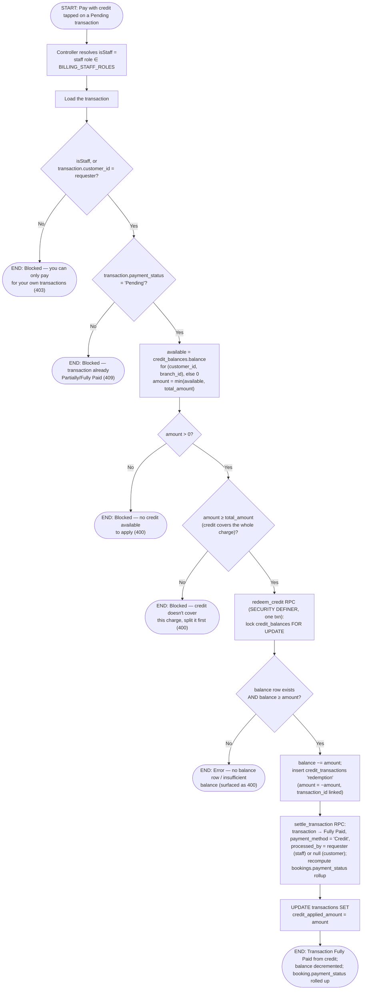

# M10 · Paying a Transaction with Credit

**Actors:** Customer (self-service), or staff on the customer's behalf (`BILLING_STAFF_ROLES`)
**Code:** `server/src/features/billing/services/transactionPayment.service.ts`
(`payTransactionWithCredit`),
`server/src/features/billing/services/creditStub.service.ts` (`getAvailableCredit`),
`server/src/features/billing/billing.controller.ts`,
`client/src/features/reports/pages/CustomerTransactionHistoryPage/CustomerTransactionHistoryPage.tsx`,
`supabase/migrations/20260901152_m08_payment_method_add_credit.sql`,
`supabase/migrations/20260901155_m10_redeem_credit_rpc.sql`
**Part of:** [[M10-credit-balance-management|M10 · Credit Balance Management]]

The redemption counterpart to
[[M10-01-cancellation-to-credit-conversion|credit issuance]]. On the portal
Transaction History page (`/portal/transactions`), a customer with a
`Pending` `booking_payment` transaction sees a **Pay with credit** button;
tapping it settles that whole transaction from their branch-locked credit
balance. Staff can do the same on a customer's behalf. This is
**full-cover only** — if the available credit can't pay the entire charge,
the caller is told to split the transaction first (via
[[M08-04-recording-a-counter-payment|Add a payment]]).

`POST /billing/transactions/:id/pay-with-credit` is behind `jwtMiddleware`
only; ownership and the staff-on-behalf allowance are decided in the service.

## Notes

- **Full-cover only, this round.** `checkout` (`applyCredit` in the same
  `creditStub.service.ts`) supports *partial* credit application, but
  `payTransactionWithCredit` deliberately does not — `amount < chargeAmount`
  is a hard 400 telling the caller to split the transaction. The two paths
  share `getAvailableCredit` and the `redeem_credit` RPC.
- **`'Credit'` is a `payment_method` enum value** added by migration
  `20260901152` (kept in its own migration file because `ALTER TYPE … ADD
  VALUE` can't be used in the same transaction that references it).
  `settle_transaction` records it like any other method; the extra
  `credit_applied_amount` stamp is a separate `UPDATE` after the settle.
- **`redeem_credit`** is the mirror of `issue_credit`: it locks the
  `credit_balances` row, re-checks `balance ≥ amount` under the lock (so a
  stale client cap can't drive the balance negative — the
  `balance >= 0` CHECK is the final backstop), decrements it, and writes a
  signed-negative `redemption` `credit_transactions` row linked to the
  transaction it paid. Credit is branch-locked
  (`UNIQUE(customer_id, branch_id)`), so the redemption always uses the
  transaction's own `branch_id`.
- **Booking rollup happens inside `settle_transaction`**, same as the
  counter path — `bookings.payment_status` moves to `Fully Paid` /
  `Partially Paid` per the shared rule. Like
  [[M08-04-recording-a-counter-payment|M08-04]], this path then calls
  `applyFirstBookingPaymentSideEffects` (`revertOnCapacityConflict = false`),
  so a first payment on a pencil booking still re-checks the slot gate and
  fires the held-back confirmation alerts.
- **`transaction_type` guard.** `payTransactionWithCredit` rejects anything
  that isn't a `booking_payment` with a 400 before touching the balance, so a
  direct API call against a `Pending` `miscellaneous_sale` can't redeem
  credit against a transaction `settle_transaction` would then refuse.
- These redemption rows are what
  [[M14-01-daily-sales-report-generation|the DSR credit-usage section]]
  reports — no longer zero now that a real redemption path exists.

## Relationship to other modules

Consumes credit issued by [[M10-01-cancellation-to-credit-conversion|M10-01]].
Settles a `booking_payment` transaction from
[[M03-01-new-appointment-booking|M03-01]] via the same `settle_transaction`
RPC as [[M08-04-recording-a-counter-payment|M08-04]]. Redemptions feed
[[M14-01-daily-sales-report-generation|M14-01]]'s credit-usage section.
Balances/history are read via
[[M10-03-credit-balance-and-history-access|M10-03]].
