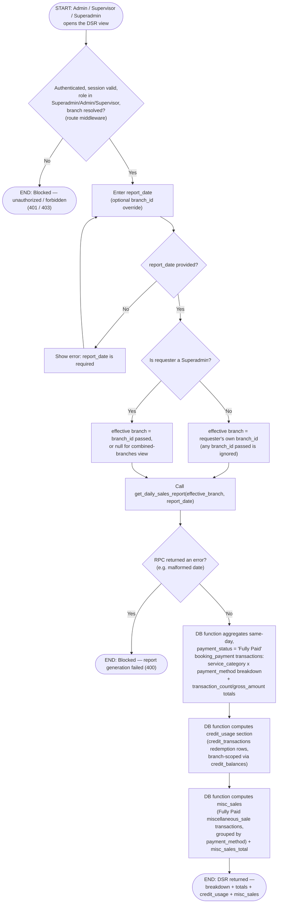

# M14 · Daily Sales Report Generation

**Actors:** Admin, Supervisor, Superadmin
**Code:** `server/src/features/reports/reports.controller.ts`,
`server/src/features/reports/reports.routes.ts`,
`server/src/features/reports/services/dailySalesReport.service.ts`,
`supabase/migrations/20260805101_m14_create_reporting_functions.sql`,
`supabase/migrations/20260901157_m14_reporting_functions_settled_only.sql`
**Part of:** [[M14-report-management|M14 · Report Management]]

An Admin, Supervisor, or Superadmin requests the Daily Sales Report for a
single calendar date; the server resolves which branch(es) the caller is
allowed to see, then a single Postgres function aggregates that day's
transactions into a category/payment-method breakdown, a totals line, a
credit-usage section, and a Miscellaneous Sales section.

## Notes

- `report_date` is a **single calendar date**, not a date range — the DSR
  is generated one day at a time (`t.created_at::date = p_report_date`);
  there is no start/end range parameter anywhere in the controller,
  service, or SQL function.
- There is no separate "payment method" filter parameter. Payment method
  is a **grouping dimension** inside the breakdown and misc-sales
  sections, not something the caller can filter down to one method.
- Branch scoping is enforced twice: the route's `requireRole`/
  `requireBranch` middleware gates who can call the endpoint at all, and
  `dailySalesReport.service.ts` separately overrides any `branch_id` an
  Admin/Supervisor passes with their own `requesterBranchId` — only a
  Superadmin's `branch_id` (or its absence, for the combined view) is
  ever trusted as-is.
- **Settled-only (migration `20260901157`).** Every `transactions`
  aggregation in the function — the category/method breakdown, the totals
  line, and the misc-sales section — now filters
  `t.payment_status = 'Fully Paid'`. This is because the payment/transactions
  rework creates a `booking_payment` row `Pending` up front (at booking
  time / via `add_booking_payment`); summing unconditionally would inflate
  gross by every uncollected charge.
- **Rows are still bucketed by `created_at::date`, not settlement date.**
  A charge created one day and settled the next still lands in the
  *creation* day's report once it flips to `Fully Paid` — there is no
  separate "settled_at" column to date against. Flagged: a payment
  collected across a day boundary can appear on a prior day's DSR the
  first time it's regenerated.
- The `credit_usage` section reads real `credit_transactions` redemption
  rows and, now that the `redeem_credit` path has shipped
  ([[M10-04-paying-a-transaction-with-credit|M10-04]] and checkout's
  `applyCredit`), it reports actual figures rather than always zero.
- **Discrepancy flagged:** both the M14 module note and the golden-fur
  repo's `.agent/skills/daily-sales-report-format.md` describe the DSR as
  also returning "individual transaction line items." The actual
  `get_daily_sales_report()` function and the `DailySalesReport` TS type
  (`reports.types.ts`) only expose `breakdown`, `totals`, `credit_usage`,
  `misc_sales`, and `misc_sales_total` — there is no line-item array in
  the returned JSON anywhere in the current implementation.

## Relationship to other modules

Reads [[M08-sales-billing|M08]] `transactions`/`bookings` data and
[[M10-credit-balance-management|M10]] `credit_transactions`/
`credit_balances` for the credit-usage section.
