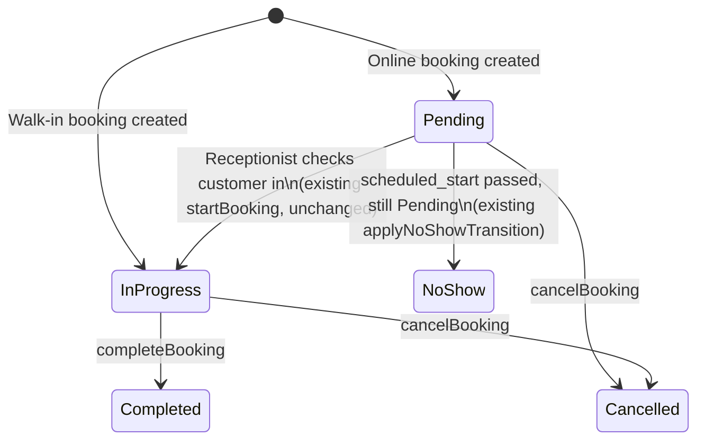
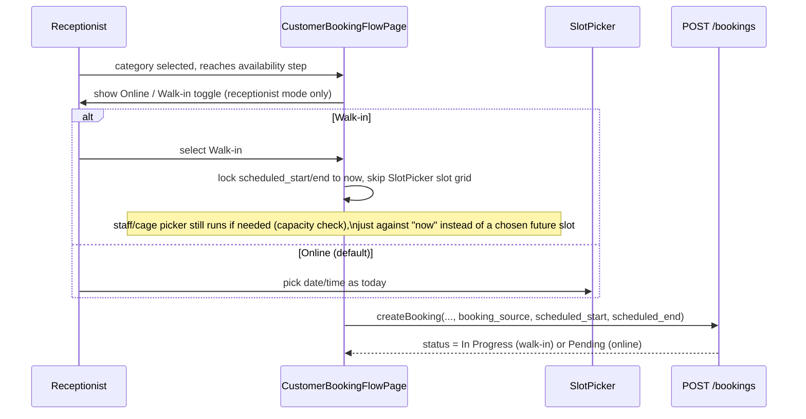

Source request: `Projects/golden-fur/docs/Architectural-Change-Suggestions.docx`
(Matthew's task row, "Not Started") + the advisor-session addendum items
J16–J19 (walk-in workflow) and A1–A5 (down payment must never lock a slot
with zero payment). Not yet implemented — this is the design to build
against.

## Problem

Today there is exactly one booking creation path —
`CustomerBookingFlowPage.tsx`, mounted at both `/portal/book` (customer)
and `/staff/bookings/new` (receptionist) — and it always requires picking
a real future `scheduled_start`/`scheduled_end` from `SlotPicker`, then
always runs the online down-payment policy. A walk-in customer standing at
the counter right now gets pushed through the same multi-step future-
appointment wizard as someone booking next Tuesday from home. The
`bookings` table has no `booking_source`/`is_walk_in` column — the only
proxy today is `created_by_staff_id IS NULL` vs. not-null, which just
means "staff created this row on someone's behalf" and conflates walk-in,
phone-in, and receptionist-assisted bookings.

A related, previously-removed precedent exists in Daycare: `stays.booking_id`
is nullable and `stays.status` was added specifically to let a walk-in
Daycare session exist with no booking row at all (`20260807104_...sql`).
The client UI for that path was intentionally removed in `65b7789` in
favor of "receptionist runs them through the normal booking flow" — which
is the exact friction this feature removes. This doc supersedes that
workaround for Grooming/Vet/Hotel/Daycare uniformly, rather than re-adding
a second, Daycare-only bypass.

## Decision

### 1. New `booking_source` column

Add `bookings.booking_source` — `'Online' | 'Walk-in'`, `NOT NULL DEFAULT
'Online'`. Backward compatible; every existing row backfills to `'Online'`.

- `'Online'`: today's behavior, unchanged — future or same-day appointment,
  booked by a customer (or a receptionist phoning/booking *on behalf of* a
  customer for a later time), goes through the down payment policy.
- `'Walk-in'`: the pet/owner is physically at the branch right now.
  Receptionist-only. Skips the down payment policy entirely and starts
  the booking already `In Progress` (see §2).

Follows the existing migration naming convention, e.g.
`202608XXNNN_m10_booking_source.sql`.

### 2. Status semantics: online → Pending → checked-in → In Progress; walk-in → In Progress directly

This adopts the simplification suggested in the source doc ("make online
bookings pending, walk-in bookings in progress") and reconciles it with
the existing lifecycle in `booking.service.ts`:

- **Online**: `status = 'Pending'` at creation — unchanged from today.
  Down payment policy (`resolveDownpaymentPolicy`) still applies in full,
  per the addendum's critical A1–A4 items (never hold a slot at zero
  payment; unpaid downpayment must not lock the slot). That work is
  already largely in place from `5170388` and is out of scope here except
  where it intersects walk-ins.
- **Walk-in**: `status = 'In Progress'` at creation, `booking_source =
  'Walk-in'`, `downpayment_required` forced to `false` regardless of
  `policy_configurations` (there is no slot-holding risk — the
  customer/pet is already present), and `payment_stage` is set from
  whatever the receptionist collects at the counter (paid in full → mark
  `payment_stage = 'Paid'` immediately via the existing
  `advancePaymentStage`/mark-paid path; no PayMongo/GCash/Maya checkout is
  invoked). `applyNoShowTransition` only ever acts on `Pending` bookings,
  so a walk-in starting at `In Progress` is never at risk of flipping to
  `No-show` — no change needed there.
- This requires one behavior that does not exist yet: an explicit
  **"check in"** action for `Pending` online bookings (Pending →
  In Progress) at the moment the customer physically arrives for their
  appointment. `startBooking` already does this transition mechanically;
  what's missing is a UI trigger for receptionists on the Bookings Queue
  (today `startBooking` is only reachable through Hotel/Daycare check-in
  panels and a generic staff "Start" action — confirm exposure on
  `ReceptionistBookingsQueuePage` before relying on it here).

### 3. Queue visibility: gate Grooming/Vet vivify queries on `In Progress` only

`grooming.service.ts` (`listGroomingQueue`) and `consultation.service.ts`
(`listConsultationQueue`) currently vivify `grooming_sessions`/
`consultations` rows for any booking with `status IN ('Pending', 'In
Progress')` (minus unpaid-downpayment ones). Change the filter to `status
= 'In Progress'` only.

Net effect: a `Pending` online appointment does **not** appear on the
Grooming/Vet queue until reception checks the customer in (§2), at which
point it's indistinguishable from — and appears alongside — a fresh
walk-in. A walk-in appears immediately since it's born `In Progress`.
This satisfies "only walk-in bookings should show up at the other
queues" for the common case while still surfacing checked-in appointments,
which staff need to actually service. **Open question for Matthew**: confirm
this reading is correct — the alternative literal reading (gate on
`booking_source = 'Walk-in'`, hiding even checked-in online appointments
from Grooming/Vet) would mean staff can never see today's confirmed
appointments in their queue at all, which seems operationally wrong. Flagging
this rather than assuming.

- **Hotel/Daycare**: no change needed to the queue itself — `stays` is
  already populated only at physical check-in (`checkInDaycareSession`,
  Hotel's equivalent), regardless of booking source, so it already
  satisfies "only what's physically here shows up." What does need
  checking during implementation: `checkInHotelStay`/
  `checkInDaycareSession` currently assume the source booking is
  `Pending` going into check-in — verify they accept a booking that's
  already `In Progress` (as a walk-in Hotel/Daycare booking would be) or
  adjust the guard.
- **Bookings Queue / Payments Queue**: unchanged — both already read
  `bookings` directly with no status floor, so both Pending (online,
  awaiting arrival/payment) and In Progress (walk-in, or checked-in
  online) bookings continue to show there, per the source doc's existing
  "online bookings ... show up at booking queue as pending, and at
  payments queue" requirement.

### 4. Booking wizard: online/walk-in toggle at the availability step

Add the choice to `CustomerBookingFlowPage.tsx`'s `availability` step
(where `SlotPicker` renders today), gated to **receptionist mode only**
(`isReceptionistMode`) — a remote customer booking from home has no walk-in
option, since walk-in definitionally requires being on-site. Default:
`'Online'`.

When `Walk-in` is selected: `scheduled_start`/`scheduled_end` are set to
"now" (or now + service duration) instead of rendering `SlotPicker`'s
day/slot grid, but the **capacity check still runs** — a walk-in still
needs a free groomer/cage/staff slot right now, it just isn't picked from
a calendar. The `items` step is unchanged. The `payment` step changes for
walk-ins: no PayMongo/GCash/Maya checkout, only counter payment methods
(Cash / card-on-site), and confirming payment there is what sets
`payment_stage` immediately (see §2) — no down payment math shown, since
`downpayment_required` is forced false server-side.

### 5. `createBooking` server changes

In `booking.service.ts`'s `createBooking` (currently lines 702–991):

- Accept `booking_source?: 'Online' | 'Walk-in'` in
  `createBookingValidator`, default `'Online'`. Reject `'Walk-in'` from a
  non-staff requester (mirrors the existing `customer_id`-requires-staff
  check at lines 706–730).
- If `'Walk-in'`: skip the `resolveDownpaymentPolicy` call (lines 787–795)
  entirely, force `downpayment_required = false`, `downpayment_amount =
  0`, and set `status = 'In Progress'` instead of the hardcoded `'Pending'`
  at lines 800–811.
- If `'Online'`: no behavior change.

## Non-goals

- Not building the "Pending online booking → checked-in" UI action itself
  as part of this doc if it already exists in some form — implementation
  should verify first (§2) rather than assume it's missing.
- Not changing the down payment policy engine (`resolveDownpaymentPolicy`,
  `policy_configurations`) — walk-ins simply bypass it, per §5.
- Not re-adding a bookingless walk-in path for Daycare (`stays.booking_id
  IS NULL`) — this doc's walk-in bookings always create a real `bookings`
  row, which is what makes them show up uniformly in Grooming/Vet/Bookings/
  Payments queues without a separate mechanism per category.
- Multi-pet walk-ins, receptionist creating a brand-new (not-yet-existing)
  customer record inline — both stay out of scope; a new walk-in customer
  is still created via `NewWalkInCustomerForm` first, same as today.

## Open questions

1. Confirmed reading of "only walk-in bookings should show up at the other
   queues" — checked-in online appointments included (§3) or excluded?
2. Does a receptionist-facing "check in" control already exist anywhere for
   Grooming/Vet, or does this doc's Pending→In Progress transition need a
   new UI entry point on `ReceptionistBookingsQueuePage`?
3. Hotel/Daycare check-in guards' assumption about incoming booking status
   — confirm before wiring walk-in Hotel/Daycare bookings through them.
